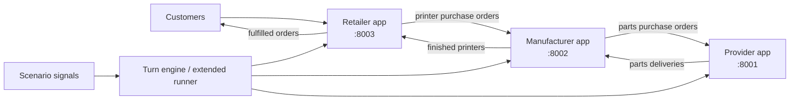

# 3D Printer Supply Chain Simulator - Agent Guide

**Project:** DGSI labs 5-8, autonomous supply chain for 3D printers  
**Current scope:** final Week 8 system with provider, manufacturer, retailer, turn engine, skills, scenarios, logs, charts, and presentation assets.

This file is the default context file for Claude Code. Treat it as the living contract for the repo. The older Week 5 single-app shape (`src/`, `run_api.py`, `/api/v1`) is no longer the implementation. The current system is three independent applications coordinated by scripts.

## System Summary

The project simulates a 3D printer supply chain day by day:



Each app owns its own SQLite state, exposes FastAPI endpoints with Swagger at `/docs`, provides a Typer CLI, logs events, and supports JSON import/export.

## Main Commands

Start the whole development stack:

```bash
./dev-stack.sh
```

Start services manually:

```bash
./provider/start_api.sh
./manufacturer/start_api.sh
./retailer/start_api.sh
./start_ui.sh
```

Seed/reset the simulation:

```bash
python3 scripts/reset_simulation.py
```

Run the Week 7 deterministic turn engine:

```bash
python3 scripts/turn_engine.py --scenario scenarios/week7.json --days 3
```

Run the Week 8 extended autonomous simulation:

```bash
python3 scripts/run_simulation.py --scenario scenarios/holiday-rush.json --days 25
python3 scripts/run_simulation.py --scenario scenarios/calm-market.json --days 15
```

Generate analysis charts from logged metrics:

```bash
python3 scripts/plot_analysis.py
```

Run the smoke check:

```bash
./scripts/check_supply_chain.sh
```

## Ports

| Service | Port | Docs |
|---|---:|---|
| Provider | 8001 | `http://localhost:8001/docs` |
| Manufacturer | 8002 | `http://localhost:8002/docs` |
| Retailer | 8003 | `http://localhost:8003/docs` |
| Manufacturer Streamlit UI | 8501 | `http://localhost:8501` |

## Repository Layout

| Path | Purpose |
|---|---|
| `provider/` | Parts supplier app: catalog, pricing tiers, stock, purchase orders, lead times, event log. |
| `manufacturer/` | Factory app: printer catalog, raw inventory, finished stock, retail sales orders, production, provider purchases, Streamlit UI. |
| `retailer/` | Retail store app: customer orders, backorders, retail stock, manufacturer purchases, retail prices. |
| `scripts/turn_engine.py` | Deterministic Week 7 orchestrator. |
| `scripts/run_simulation.py` | Extended Week 8 runner with skill-agent hooks, scenario signals, metrics, and narrative logs. |
| `scripts/agent_runner.py` | Invokes Codex or Claude in print mode for role skills. |
| `scripts/plot_analysis.py` | Builds inventory, price, fulfillment, event, and comparison charts. |
| `skills/` | Role instructions: provider, manufacturer, and retail manager. |
| `scenarios/` | `week7.json`, `calm-market.json`, `holiday-rush.json`, and `presentation-demo.json`. |
| `reports/` | Analysis markdown, generated charts, presentation, and final lab reports. |
| `docs/PRD.md` | Final PRD for the current multi-app system. |

## App Responsibilities

### Provider

Code lives in `provider/app/`.

Core behavior:

- Catalog of raw parts with tiered prices and product lead times.
- Own stock levels and event log.
- Order lifecycle: `pending -> confirmed -> in_progress -> shipped -> delivered`.
- Minimum effective lead time is one day.
- Market signals can adjust restock yield and effective lead time.
- JSON export/import at `/api/export` and `/api/import`.

Important endpoints:

- `GET /api/catalog`
- `GET /api/stock`
- `POST /api/orders`
- `GET /api/orders`
- `GET /api/orders/{id}`
- `POST /api/day/advance`
- `GET /api/day/current`
- `POST /api/market-signal`
- `GET /api/events`

Important CLI examples:

```bash
./provider/start_cli.sh catalog
./provider/start_cli.sh stock
./provider/start_cli.sh orders list
./provider/start_cli.sh restock kit_piezas 50
./provider/start_cli.sh price set kit_piezas 10 150
./provider/start_cli.sh day advance
```

### Manufacturer

Code lives in `manufacturer/app/`.

Core behavior:

- Receives printer orders from retailers.
- Releases orders to production.
- Consumes BOM parts when released orders enter production.
- Tracks production durations per printer model.
- Ships completed printers to retailers and marks them delivered one day later.
- Orders raw parts from configured providers and polls remote provider order status on day advance.
- Provides a Streamlit dashboard in `manufacturer/app/ui.py`.

Important endpoints:

- `GET /api/catalog`
- `GET /api/stock`
- `GET /api/finished-stock`
- `POST /api/orders`
- `GET /api/orders`
- `POST /api/orders/{order_id}/release`
- `GET /api/production/status`
- `GET /api/capacity`
- `GET /api/providers`
- `GET /api/providers/{supplier_name}/catalog`
- `POST /api/purchases`
- `GET /api/purchases`
- `POST /api/day/advance`
- `GET /api/events`

Important CLI examples:

```bash
./manufacturer/start_cli.sh sales orders
./manufacturer/start_cli.sh production release 4
./manufacturer/start_cli.sh purchase create --supplier "ChipSupply Co" --product kit_piezas --qty 20
./manufacturer/start_cli.sh price raise-all 10
./manufacturer/start_cli.sh day advance
```

### Retailer

Code lives in `retailer/app/`.

Core behavior:

- Receives deterministic customer demand from the runner.
- Processes every pending customer order into `fulfilled` or `backordered`.
- Buys finished printers from the manufacturer.
- Polls manufacturer order status and receives printer stock when delivered.
- Synchronizes wholesale prices from the manufacturer and enforces a markup floor.
- JSON export/import at `/api/export` and `/api/import`.

Important endpoints:

- `GET /api/catalog`
- `POST /api/catalog/sync`
- `GET /api/stock`
- `POST /api/orders`
- `GET /api/orders`
- `POST /api/orders/{order_id}/fulfill`
- `POST /api/orders/{order_id}/backorder`
- `POST /api/purchases`
- `GET /api/purchases`
- `POST /api/day/advance`
- `GET /api/events`

Important CLI examples:

```bash
./retailer/start_cli.sh process-orders
./retailer/start_cli.sh purchase create P3D-Classic 6
./retailer/start_cli.sh price raise-all 7
./retailer/start_cli.sh day advance
```

## Turn Order

The Week 7 deterministic engine and Week 8 runner both keep one shared simulated calendar across services.

Week 8 extended run:

1. Load the day signal from the scenario.
2. Apply provider market signal (`supply_modifier`, `lead_time_modifier`).
3. Inject deterministic customer demand into the retailer.
4. Run role decisions for provider, manufacturer, and retailer.
5. Advance all three apps.
6. Capture metrics and narrative logs.

The scenario merge rule for overlapping events is multiplicative: demand, supply, and lead-time modifiers multiply. This is documented and used by `scripts/run_simulation.py`.

## Skills

All role skills are in `skills/`:

- `skills/provider-manager.md`
- `skills/manufacturer-manager.md`
- `skills/retail-manager.md`

The skills deliberately forbid `day advance`; only the engine advances time. They also use "fast path" command hints from the runner so the agent does not waste turns rediscovering the state that was already provided.

## Scenarios and Results

Required scenarios exist:

- `scenarios/calm-market.json`: stable control run.
- `scenarios/holiday-rush.json`: volatile run with Black Friday, chip shortage, and Christmas rush.

Observed run artifacts exist in `logs/` and generated charts exist in `reports/`:

- `reports/calm-market_dashboard.png`
- `reports/holiday-rush_dashboard.png`
- `reports/holiday-rush_provider_detail.png`
- `reports/holiday-rush_manufacturer_detail.png`
- `reports/holiday-rush_retailer_detail.png`
- `reports/comparison.png`

The current logs show a 15-day calm run and a 25-day holiday run.

## Coding Conventions

- Keep FastAPI handlers thin; put business logic in `app/services.py`.
- Keep CLI commands as thin wrappers over service methods.
- Use Pydantic schemas for REST request/response models.
- Preserve explicit order status transitions; do not hide lifecycle state behind booleans.
- Every significant mutation must log an event.
- Never commit `.env`, `*.db`, `venv/`, `.venv/`, `__pycache__/`, or `logs/`.
- Prefer deterministic scenario runs when producing report evidence.
- Do not invent new ports or app names unless configs are updated too.

## Final Deliverable Checklist

- Provider, manufacturer, and retailer source code present.
- Three app seed files present.
- Three role skill files present.
- At least two scenario files present.
- Turn engine and extended simulation runner present.
- Event logs, metrics logs, analysis charts, and presentation artifacts present.
- `docs/PRD.md`, `README.md`, `.gitignore`, and this `CLAUDE.md` reflect the final architecture.
- Reports for labs 6, 7, and 8 exist in markdown.
- Merged PDF generated from markdown using pandoc and mermaid-filter.
