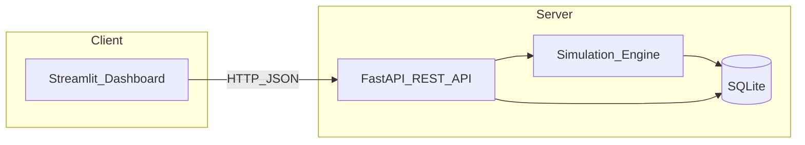
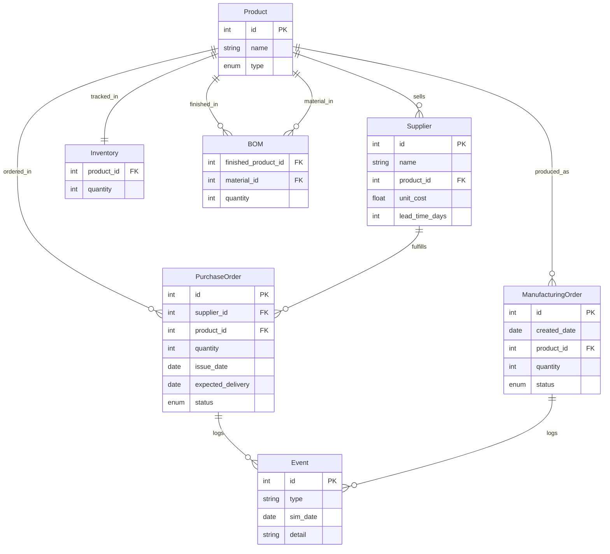

# 3D Printer Production Simulator — Specification

**Version:** 1.0  
**Last updated:** 2025-03-26  
**Audience:** AI agents, developers, and reviewers implementing or extending this system.

This document is the single source of truth for behavior, data, APIs, and UI. Supplementary diagrams may exist under `.cursor/projects/.../assets/` for human reference; implementations should follow this markdown.

---

## 1. Objective and scope

### 1.1 Objective

Build a software system that simulates, **day by day**, the full production cycle of a factory that manufactures **3D printers**. The focus is on:

- **Inventory management**
- **Purchasing**
- **Production planning**

### 1.2 Scope

The simulation models:

- Demand (random manufacturing orders)
- Bill of materials (BOM) consumption
- Supplier lead times and purchase order fulfillment
- Daily production capacity
- Warehouse capacity (simplified storage model)
- Event history for auditing and charts

Out of scope unless explicitly added later: accounting beyond simple cost display, multi-factory logistics, detailed shop-floor scheduling, and real hardware integration.

### 1.3 User role

The user plays the **production planner**: they decide **what to manufacture** (releasing orders) and **what to buy** (issuing purchase orders). The system automates time progression, demand generation, stock checks, capacity limits, deliveries, and logging.

---

## 2. Recommended architecture

The UI must stay simple (no complex client-side installation). A typical layout:



- **Streamlit** (or equivalent thin client) calls the backend over HTTP.
- **FastAPI** exposes REST endpoints and OpenAPI documentation; it orchestrates reads/writes and invokes the simulation engine.
- **Simulation engine** implements discrete daily logic (SimPy is **recommended** but not mandatory; a clear turn-based day loop is acceptable if justified).
- **SQLite** persists authoritative state; JSON files may be used for import/export or auxiliary config.

---

## 3. Proposed tech stack

| Layer | Tool | Reason |
| :--- | :--- | :--- |
| Language | Python 3.11+ | Widely used, simple syntax |
| Simulation | SimPy (recommended) | Discrete-event style fits day cycles; easy to reason about |
| Persistence | SQLite and/or JSON files | Lightweight, portable |
| Back-end / API | FastAPI + Pydantic | REST API with automatic OpenAPI docs |
| UI | Streamlit | Fast dashboard construction |
| Charts | matplotlib | Integrates with Streamlit |
| Version control | Git + GitHub (or equivalent) | Standard workflow |

**Note:** SimPy is recommended but not mandatory. If the team prefers a simpler approach (e.g. a strict turn-based day loop), document the choice and keep behavior aligned with this specification.

---

## 4. Functional requirements

### R0 — Initial configuration

The system must support an **initial production plan** including:

| Item | Description |
| :--- | :--- |
| **BOM per printer model** | For each finished good, which raw materials (by product identity) and in what quantities are required |
| **Assembly time per model** | Used to enforce **daily production capacity** together with global or per-line limits (see R4) |
| **Supplier catalog** | Which suppliers sell which products; **pricing** may be tiered (e.g. per pallet of 1000, per box of 20) |
| **Lead time** | Days from purchase issue to delivery (per supplier–product or supplier default, as implemented) |
| **Warehouse capacity** | Simplified rule: **1 unit of any material = 1 storage unit**; total capacity is configurable |

**Implementation note (pricing vs schema):** The canonical relational model (Section 7) uses `Supplier.unit_cost` as a single float. Implementations may store an effective cost per ordering unit, compute tier breaks in application code, or extend the schema with price tiers—behavior must match the configured catalog.

**Implementation note (BOM keys):** Configuration may use string keys (e.g. `pcb_ref: "CTRL-V2"`). The implementation **must resolve** every BOM line to `Product` records (see Section 13).

---

### R1 — Demand generation

At the **start of each simulated day** (after the calendar advances into that day, before end-of-day processing unless otherwise documented in code), **new manufacturing orders** are generated **randomly**.

- Parameters: **mean** and **variance** (or equivalent distribution parameters) must be **configurable**.
- Generated orders are **pending** until the planner releases them (R3).

---

### R2 — Control dashboard

The dashboard must display at least:

- **Pending orders** (manufacturing orders awaiting release)
- **Bill of materials breakdown** for each such order (quantities per material)
- **Current inventory levels**

---

### R3 — User decisions

The planner must be able to:

1. **Release** selected manufacturing orders to production (subject to stock and rules in R4).
2. **Issue purchase orders**: choose **product**, **supplier**, **quantity**, and relevant **dates** (issue date; expected delivery derived from lead time or stored explicitly).

---

### R4 — Event simulation

The engine must model:

1. **Raw material consumption** during manufacturing, **limited by daily capacity** (and available materials).
2. **Purchase arrivals** according to **supplier lead time** (orders become deliverable on the expected delivery date; status transitions should be logged—see R6).

Capacity, BOM checks, and inventory updates must be consistent with **R0** configuration.

---

### R5 — Calendar advance

A control (e.g. button) **“Advance Day”** runs the **24-hour simulation cycle** for the current day: engine steps in Section 10 apply, then the simulated date increments (or the cycle is defined equivalently but documented).

---

### R6 — Event log

**All significant events** must be recorded for **historical tracking** and **charts** (e.g. stock over time, completed orders over time). Minimum event types should include: demand generated, order released, production started/completed, purchase issued, shipment/delivery, inventory adjustments, capacity limits hit, shortages.

---

### R7 — JSON import / export

The system must support **export** and **import** of:

| Data | Minimum |
| :--- | :--- |
| **Inventory state** | Required |
| **Event history** | Required |

Optional extensions: full snapshot (products, suppliers, BOM, open POs/MOs, simulation date, configuration)—recommended for backup and portability.

---

### R8 — REST API

- **Every** capability and **every** piece of information shown in the UI must be available via a **REST API**.
- APIs must be documented with **Swagger / OpenAPI** (FastAPI default is acceptable).

---

## 5. Non-functional requirements

- **Clean, commented code** under **Git** version control.
- **Simple web interface**; no complex client-side installation.
- **Cross-platform:** Windows, macOS, Linux.

---

## 6. Data model (relational)

### 6.1 Entities and attributes

Approximate schema (aligns with the project ER diagram):

#### Product

| Column | Type | Notes |
| :--- | :--- | :--- |
| `id` | int | Primary key |
| `name` | string | |
| `type` | enum | `raw` \| `finished` |

#### Supplier

| Column | Type | Notes |
| :--- | :--- | :--- |
| `id` | int | Primary key |
| `name` | string | |
| `product_id` | int | FK → `Product.id` (supplier sells this product) |
| `unit_cost` | float | See R0 pricing note |
| `lead_time_days` | int | |

#### Inventory

| Column | Type | Notes |
| :--- | :--- | :--- |
| `product_id` | int | FK → `Product.id`; logically one row per tracked product |
| `quantity` | int | |

#### BOM (Bill of Materials)

| Column | Type | Notes |
| :--- | :--- | :--- |
| `finished_product_id` | int | FK → `Product.id` (finished good) |
| `material_id` | int | FK → `Product.id` (raw component) |
| `quantity` | int | Units per finished unit |

#### PurchaseOrder

| Column | Type | Notes |
| :--- | :--- | :--- |
| `id` | int | Primary key |
| `supplier_id` | int | FK → `Supplier.id` |
| `product_id` | int | FK → `Product.id` |
| `quantity` | int | |
| `issue_date` | date | Simulated calendar |
| `expected_delivery` | date | |
| `status` | enum | `pending` \| `shipped` \| `delivered` |

#### ManufacturingOrder

| Column | Type | Notes |
| :--- | :--- | :--- |
| `id` | int | Primary key |
| `created_date` | date | |
| `product_id` | int | FK → `Product.id` (finished product) |
| `quantity` | int | |
| `status` | enum | `pending` \| `in_progress` \| `completed` |

#### Event

| Column | Type | Notes |
| :--- | :--- | :--- |
| `id` | int | Primary key |
| `type` | string | Machine-readable type recommended |
| `sim_date` | date | |
| `detail` | string | JSON or human-readable payload |

### 6.2 Relationships (summary)

- **Product → Supplier:** one product, many suppliers (each supplier row ties to one product in the minimal model).
- **Product → BOM:** finished product has many BOM rows; materials are products of type `raw`.
- **Product → Inventory:** one inventory row per product (1:1 tracking).
- **Product → PurchaseOrder / ManufacturingOrder:** one product, many orders.
- **PurchaseOrder / ManufacturingOrder → Event:** orders generate many log events (dashed “logs” relationship in diagrams).

### 6.3 ER sketch (mermaid)



---

## 7. REST API principles and endpoint inventory

### 7.1 Principles

- Base path may be prefixed consistently (e.g. `/api/v1`); all routes below are **logical** names.
- Request/response bodies should use **Pydantic** (or equivalent) models mirroring the UI needs.
- **UI/API parity (R8):** any screen action must have a corresponding endpoint.

### 7.2 Core flows (from sequence diagrams)

| Action | Method | Path (example) | Behavior |
| :--- | :--- | :--- | :--- |
| Advance simulated day | `POST` | `/api/day/advance` | Runs `run_day()` (Section 10); returns updated state summary |
| Release manufacturing order | `POST` | `/api/orders/{order_id}/release` | Check BOM, verify stock, update MO status; error if insufficient stock |
| Create purchase order | `POST` | `/api/purchases` | Create PO with delivery in N days per supplier lead time |

### 7.3 Additional endpoints (expected for R2, R3, R6, R7)

Implementations should expose (names may vary; document in OpenAPI):

- `GET` simulated calendar / current day
- `GET` pending manufacturing orders (with BOM expansion)
- `GET` inventory (optionally with shortage flags vs BOM demand)
- `GET` suppliers, products, production configuration
- `GET` events (filter by date/type) for dashboard and export
- `POST` import / `GET` export JSON (R7)
- Any read needed for charts: time series derived from events and/or snapshots

---

## 8. Minimum UI layout

| Area | Content |
| :--- | :--- |
| **Header** | Current **simulated day**; **Advance Day** button |
| **Orders panel** | Table of **pending** manufacturing orders; **automatic BOM** calculation per row |
| **Inventory panel** | Stock levels; **highlight shortages** |
| **Purchasing panel** | Supplier dropdown; quantity input; **Issue order** (or “Issue purchase”) action |
| **Production panel** | **Daily capacity**; queue of releasable orders; orders **in progress** |
| **Charts** | Stock levels and **completed orders** (or throughput) over simulated time |

---

## 9. Daily simulation flow

When the planner triggers **Advance Day**:

1. **Simulation engine** runs the **24h cycle** for the current simulated date (`run_day()` or equivalent).
2. **Generate new manufacturing orders** (R1) — random demand with configurable mean/variance.
3. **Process pending deliveries** — purchase orders whose `expected_delivery` matches this day (or lead-time logic) move material into inventory; log events.
4. **Process production** — for orders **released** and in progress: consume BOM quantities, respect **daily capacity** and assembly times; advance MO statuses; log events.
5. **Log all events** (R6) with `sim_date` and structured `detail` where useful.
6. Return **day results** to the API and UI: updated orders, inventory, alerts.
7. Advance the **simulated calendar** to the next day (unless the implementation treats “advance” as “execute end-of-day then flip date” — document one ordering and keep it consistent).

After the cycle, the **dashboard** refreshes so the planner can make new decisions (release orders, purchases) before the next advance.

---

## 10. Example production plan (JSON)

Global capacity and per-model BOMs (illustrative; `pcb_ref` must resolve to a `Product`):

```json
{
  "capacity_per_day": 10,
  "models": {
    "P3D-Classic": {
      "bom": {
        "kit_piezas": 1,
        "pcb": 1,
        "pcb_ref": "CTRL-V2",
        "extrusor": 1,
        "cables_conexion": 2,
        "transformador_24v": 1,
        "enchufe_schuko": 1
      }
    },
    "P3D-Pro": {
      "bom": {
        "kit_piezas": 1,
        "pcb": 1,
        "pcb_ref": "CTRL-V3",
        "extrusor": 1,
        "sensor_autonivel": 1,
        "cables_conexion": 3,
        "transformador_24v": 1,
        "enchufe_schuko": 1
      }
    }
  }
}
```

---

## 11. Example scenario (walkthrough)

- **Day 1:** Starting stock = **30** part kits. Capacity = **10** printers/day. The system generates **two** manufacturing orders: **8** and **6** units. The planner **releases only the order for 8**. The system consumes **8** kits. **22** kits remain. No purchase needed yet.

- **Day 2:** Two **new** orders arrive: **5** and **7** units. Stock is running low. The planner buys **20** kits from **Supplier A** (example: **90 EUR/kit**, lead time **3** days).

- **Day 5:** The purchased kits **arrive** (per lead time). Production can resume at **full capacity**.

The interesting dynamics are the tension between **demand**, **inventory**, **capacity**, and **lead times**.

---

## 12. Persistence and JSON (R7)

- **SQLite** holds durable state: configuration references, inventory, orders, events.
- **JSON** import/export must cover at minimum **inventory** and **event** streams; a **full snapshot** export/import is recommended for round-tripping scenarios.

---

## 13. Implementation notes and open decisions

1. **BOM key resolution:** Keys such as `pcb_ref` denote a specific PCB **variant**; map them to `Product.id` (and type `raw`) during load. Duplicate logical lines (`pcb` + `pcb_ref`) should be merged into a single resolved material line in the engine.

2. **Order of operations within a day:** R1 says demand arrives at the **start** of the day; Section 9 lists generation first, then deliveries, then production. Keep one documented ordering in code and tests.

3. **Supplier–product cardinality:** If one supplier sells many products, extend `Supplier` or add a junction table; the minimal model uses one `product_id` per supplier row—normalize if the scenario requires multi-SKU suppliers per row.

4. **Warehouse capacity:** Enforce total storage against configurable max when receiving purchases or finishing goods; overflow policy (reject vs cap) should be explicit in implementation.

---

## 14. Traceability matrix (R0–R8)

| ID | Primary sections |
| :--- | :--- |
| R0 | §4 R0, §6, §10, §13 |
| R1 | §4 R1, §9 |
| R2 | §4 R2, §8, §7.3 |
| R3 | §4 R3, §7.2 |
| R4 | §4 R4, §9 |
| R5 | §4 R5, §7.2, §8 |
| R6 | §4 R6, §6 `Event`, §8 charts |
| R7 | §4 R7, §12, §7.3 |
| R8 | §4 R8, §7 |

---

*End of specification.*
