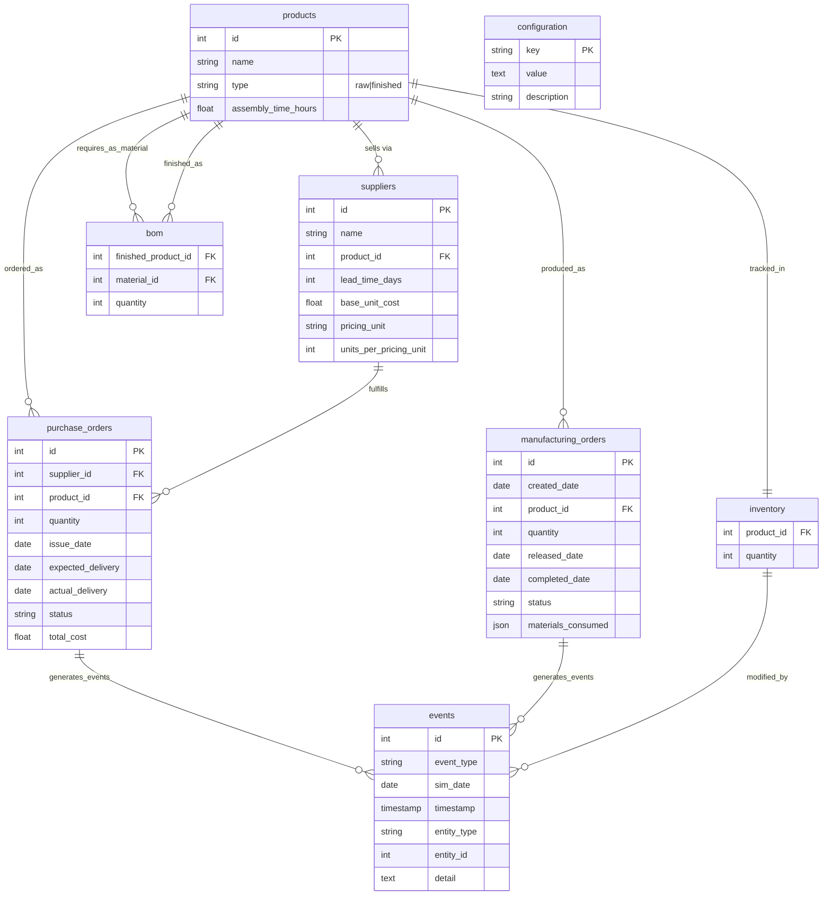
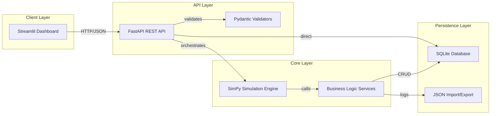

# Product Requirements Document (PRD) — 3D Printer Production Simulator

**Version:** 1.0  
**Last updated:** 2026-03-26  
**Status:** Draft for Review  

---

## 1. Executive Summary

This document defines the product requirements for a **3D Printer Production Simulator**—a discrete-event simulation system that models day-by-day factory operations for manufacturing 3D printers. The system focuses on inventory management, purchasing decisions, and production planning, with the user playing the role of **production planner**.

### 1.1 Goals

- Simulate realistic production dynamics: demand generation, BOM consumption, supplier lead times, capacity limits
- Provide an interactive dashboard for decision-making (release orders, issue purchase orders)
- Persist all state in SQLite for auditability and reproducibility
- Expose full REST API for integration and automation
- Enable import/export for backup and scenario sharing

### 1.2 Non-Goals (V1)

- Multi-factory logistics
- Detailed shop-floor scheduling beyond daily capacity
- Real hardware integration
- Advanced accounting beyond simple cost display
- Automated testing infrastructure (explicitly deferred per stakeholder decision)

---

## 2. Data Model

The canonical data model uses SQLite with the following schema. All tables include `created_at` and `updated_at` timestamps for auditing.

### 2.1 Core Tables

#### `products`

| Column | Type | Constraints | Description |
| :--- | :--- | :--- | :--- |
| `id` | INTEGER | PRIMARY KEY AUTOINCREMENT | Unique product identifier |
| `name` | TEXT | NOT NULL, UNIQUE | Human-readable name |
| `type` | TEXT | NOT NULL CHECK(type IN ('raw', 'finished')) | Material classification |
| `assembly_time_hours` | REAL | DEFAULT NULL | Hours to assemble; NULL for raw materials |

#### `suppliers`

| Column | Type | Constraints | Description |
| :--- | :--- | :--- | :--- |
| `id` | INTEGER | PRIMARY KEY AUTOINCREMENT | Unique supplier identifier |
| `name` | TEXT | NOT NULL | Supplier company name |
| `product_id` | INTEGER | NOT NULL, FOREIGN KEY → products.id | Product this supplier sells |
| `lead_time_days` | INTEGER | NOT NULL | Days from order to delivery |
| `base_unit_cost` | REAL | NOT NULL | Cost per base ordering unit |
| `pricing_unit` | TEXT | NOT NULL DEFAULT 'unit' | Ordering unit: 'unit', 'box', 'pallet' |
| `units_per_pricing_unit` | INTEGER | NOT NULL DEFAULT 1 | Quantity per pricing unit (e.g., 1000/pallet) |

*Note: Tiered pricing is implemented at application layer by computing effective cost based on quantity ordered vs. `pricing_unit`.*

#### `inventory`

| Column | Type | Constraints | Description |
| :--- | :--- | :--- | :--- |
| `product_id` | INTEGER | PRIMARY KEY, FOREIGN KEY → products.id | Product being tracked |
| `quantity` | INTEGER | NOT NULL DEFAULT 0 | Current stock level |

#### `bom` (Bill of Materials)

| Column | Type | Constraints | Description |
| :--- | :--- | :--- | :--- |
| `finished_product_id` | INTEGER | NOT NULL, FOREIGN KEY → products.id | Finished good |
| `material_id` | INTEGER | NOT NULL, FOREIGN KEY → products.id | Required raw material |
| `quantity` | INTEGER | NOT NULL | Units per finished unit |
| PRIMARY KEY (`finished_product_id`, `material_id`) | | | Composite key |

#### `purchase_orders`

| Column | Type | Constraints | Description |
| :--- | :--- | :--- | :--- |
| `id` | INTEGER | PRIMARY KEY AUTOINCREMENT | Unique PO identifier |
| `supplier_id` | INTEGER | NOT NULL, FOREIGN KEY → suppliers.id | Fulfilling supplier |
| `product_id` | INTEGER | NOT NULL, FOREIGN KEY → products.id | Product being ordered |
| `quantity` | INTEGER | NOT NULL | Quantity ordered |
| `issue_date` | DATE | NOT NULL | Simulated date when PO was created |
| `expected_delivery` | DATE | NOT NULL | Calculated as issue_date + lead_time |
| `actual_delivery` | DATE | NULLABLE | Actual arrival date (may differ) |
| `status` | TEXT | NOT NULL DEFAULT 'pending' | 'pending' \| 'shipped' \| 'delivered' \| 'cancelled' |
| `total_cost` | REAL | NULLABLE | Final cost including tiered pricing |

#### `manufacturing_orders`

| Column | Type | Constraints | Description |
| :--- | :--- | :--- | :--- |
| `id` | INTEGER | PRIMARY KEY AUTOINCREMENT | Unique MO identifier |
| `created_date` | DATE | NOT NULL | Demand generation date |
| `product_id` | INTEGER | NOT NULL, FOREIGN KEY → products.id | Printer model being produced |
| `quantity` | INTEGER | NOT NULL | Number of units requested |
| `released_date` | DATE | NULLABLE | When planner released to production |
| `completed_date` | DATE | NULLABLE | When production finished |
| `status` | TEXT | NOT NULL DEFAULT 'pending' | 'pending' \| 'in_progress' \| 'completed' \| 'cancelled' |
| `materials_consumed` | JSON | NULLABLE | Snapshot of consumed materials |

#### `events`

| Column | Type | Constraints | Description |
| :--- | :--- | :--- | :--- |
| `id` | INTEGER | PRIMARY KEY AUTOINCREMENT | Unique event identifier |
| `event_type` | TEXT | NOT NULL | Machine-readable category |
| `sim_date` | DATE | NOT NULL | Simulated date of occurrence |
| `timestamp` | TIMESTAMP | NOT NULL DEFAULT CURRENT_TIMESTAMP | Real-time log timestamp |
| `entity_type` | TEXT | NULLABLE | 'MO' \| 'PO' \| 'INVENTORY' \| etc. |
| `entity_id` | INTEGER | NULLABLE | Reference to affected entity |
| `detail` | TEXT | NULLABLE | JSON payload or human-readable description |

#### `configuration`

| Column | Type | Constraints | Description |
| :--- | :--- | :--- | :--- |
| `key` | TEXT | PRIMARY KEY | Configuration key |
| `value` | TEXT | NOT NULL | JSON-encoded value |
| `description` | TEXT | NULLABLE | Documentation |

*Predefined keys:*
- `capacity_per_day`: INTEGER — Max finished units producible per day
- `warehouse_capacity`: INTEGER — Max storage units (1 material unit = 1 storage unit)
- `demand_mean`: FLOAT — Average daily demand (printers)
- `demand_variance`: FLOAT — Variance for demand generation
- `initial_inventory`: JSON — Map of product_id → starting quantity

---

### 2.2 Entity Relationship Diagram



---

### 2.3 Event Types

All significant state changes generate events. Minimum event types:

| Event Type | Trigger | Detail Payload |
| :--- | :--- | :--- |
| `DEMAND_GENERATED` | Random order creation | `{product_id, quantity}` |
| `MO_RELEASED` | Planner releases MO | `{mo_id, product_id, quantity}` |
| `PRODUCTION_STARTED` | First unit of MO processed | `{mo_id, remaining_units}` |
| `PRODUCTION_COMPLETED` | MO fully manufactured | `{mo_id, product_id, quantity}` |
| `PO_ISSUED` | Purchase order created | `{po_id, supplier_id, quantity}` |
| `PO_SHIPPED` | Supplier ships order | `{po_id, expected_delivery}` |
| `PO_DELIVERED` | Goods arrive at warehouse | `{po_id, quantity, new_stock_level}` |
| `INVENTORY_ADJUSTMENT` | Any stock change | `{product_id, delta, reason}` |
| `CAPACITY_HIT_LIMIT` | Daily capacity reached | `{units_produced, remaining_capacity}` |
| `STOCKOUT_WARNING` | Inventory depleted | `{product_id, pending_demand}` |
| `WAREHOUSE_FULL` | Delivery exceeds capacity | `{current_usage, capacity, rejected_quantity}` |
| `DAY_ADVANCED` | Simulation cycle complete | `{day_number, events_count}` |

---

## 3. Architecture

### 3.1 High-Level Design



### 3.2 Component Responsibilities

| Component | Responsibility | Technology |
| :--- | :--- | :--- |
| **Streamlit Dashboard** | User interface, visualizations, user inputs | streamlit |
| **FastAPI Server** | HTTP endpoints, request validation, async I/O | fastapi, uvicorn |
| **Pydantic Models** | Schema validation, serialization | pydantic v2 |
| **SimPy Environment** | Time progression, process scheduling | simpy |
| **BOM Service** | Material requirement calculation, shortage detection | pure Python |
| **Inventory Service** | Stock checks, allocations, adjustments | pure Python |
| **Purchasing Service** | PO lifecycle, tiered pricing calc | pure Python |
| **Production Service** | Capacity management, MO processing | pure Python |
| **Event Logger** | Centralized event recording | pure Python |
| **Import/Export Service** | State serialization, restoration | JSON |

### 3.3 Directory Structure

```
printer-factory-sim/
├── docs/
│   ├── PRD.md                 # This document
│   ├── SPEC.md               # Original specification
│   └── ARCHITECTURE.md       # Extended architecture notes
├── src/
│   ├── __init__.py
│   ├── main.py               # FastAPI app factory
│   ├── config.py             # Settings, constants
│   ├── database.py           # SQLAlchemy engine, SessionLocal
│   │
│   ├── models/               # SQLModel / SQLAlchemy models
│   │   ├── __init__.py
│   │   ├── product.py
│   │   ├── supplier.py
│   │   ├── inventory.py
│   │   ├── bom.py
│   │   ├── purchase_order.py
│   │   ├── manufacturing_order.py
│   │   └── event.py
│   │
│   ├── schemas/              # Pydantic DTOs
│   │   ├── __init__.py
│   │   ├── product.py
│   │   ├── supplier.py
│   │   ├── inventory.py
│   │   ├── bom.py
│   │   ├── purchase_order.py
│   │   ├── manufacturing_order.py
│   │   ├── event.py
│   │   └── simulation.py     # Day results, configuration
│   │
│   ├── services/             # Business logic
│   │   ├── __init__.py
│   │   ├── bom_service.py
│   │   ├── inventory_service.py
│   │   ├── purchasing_service.py
│   │   ├── production_service.py
│   │   ├── demand_service.py
│   │   ├── event_service.py
│   │   └── import_export_service.py
│   │
│   ├── simulation/           # SimPy processes
│   │   ├── __init__.py
│   │   ├── environment.py    # SimPy env setup
│   │   ├── processes.py      # Day loop, PO/MO processes
│   │   └── clock.py          # Date handling
│   │
│   └── api/                  # FastAPI routers
│       ├── __init__.py
│       ├── simulation.py     # Day advancement
│       ├── products.py
│       ├── suppliers.py
│       ├── inventory.py
│       ├── manufacturing_orders.py
│       ├── purchase_orders.py
│       ├── events.py
│       └── import_export.py
│
├── app.py                    # Streamlit entry point
├── run_api.py                # Standalone API server
├── initialize_db.py          # DB bootstrap script
├── config/
│   ├── default.json          # Default configuration
│   └── scenarios/            # Example scenario files
│       ├── quick_start.json
│       └── challenging.json
│
├── data/                     # SQLite database location
│   └── .gitkeep
│
├── tests/                    # Tests (future)
│   └── .gitkeep
│
├── requirements.txt
├── requirements-dev.txt
├── README.md
└── .env.example
```

---

## 4. Tech Stack Decisions

| Layer | Technology | Rationale | Version Target |
| :--- | :--- | :--- | :--- |
| Language | Python | Simple syntax, rich ecosystem | 3.11+ |
| Simulation | SimPy | Discrete-event fits day cycles; well-tested | 4.x |
| Web Framework | FastAPI | Async support, auto OpenAPI docs | 0.109+ |
| ORM | SQLModel | SQLAlchemy + Pydantic hybrid | 0.0.x |
| Validation | Pydantic v2 | Strict typing, validation | 2.x |
| UI | Streamlit | Rapid dashboard development | 1.30+ |
| Charts | matplotlib | Streamlit-compatible | 3.8+ |
| Database | SQLite | Zero-config, portable | Built-in |
| Async Runtime | uvicorn | ASGI server | 0.27+ |

**Why SimPy?**  
Per your decision (#1), SimPy provides:
- Natural time progression via `env.now`
- Process-based modeling for PO deliveries and MO production
- Easy to simulate partial days, delays, and concurrent activities
- Extensibility for future features (maintenance windows, breakdowns)

**Alternative Considered:** Custom turn-based loop was considered simpler but would make modeling staggered deliveries and mid-day events harder. SimPy is worth the marginal learning curve.

---

## 5. API Endpoints

### 5.1 Design Principles

- Base path: `/api/v1`
- All responses: JSON with consistent envelope where appropriate
- Authentication: None for V1 (local deployment only)
- Error handling: Standard HTTP status codes, error messages in `{"detail": "..."}` format

### 5.2 Endpoint Inventory

#### Simulation Control

| Method | Endpoint | Description | Request | Response |
| :--- | :--- | :--- | :--- | :--- |
| GET | `/api/v1/simulation/status` | Current sim date, day count | - | `{current_date, day_count, config}` |
| POST | `/api/v1/simulation/day/advance` | Run one day cycle | `{}` | `{date, events_generated, summary}` |
| POST | `/api/v1/simulation/reset` | Reset to initial state | `{confirm=True}` | `{message}` |
| GET | `/api/v1/simulation/configuration` | Get all config | - | `{key-value pairs}` |
| PUT | `/api/v1/simulation/configuration/{key}` | Update single config | `{value}` | `{updated}` |

#### Products

| Method | Endpoint | Description |
| :--- | :--- | :--- |
| GET | `/api/v1/products` | List all products |
| GET | `/api/v1/products/{product_id}` | Get single product |
| POST | `/api/v1/products` | Create product |
| PUT | `/api/v1/products/{product_id}` | Update product |
| DELETE | `/api/v1/products/{product_id}` | Delete product (if no dependencies) |

#### Suppliers

| Method | Endpoint | Description |
| :--- | :--- | :--- |
| GET | `/api/v1/suppliers` | List all suppliers |
| GET | `/api/v1/suppliers?product_id=X` | Filter by product |
| GET | `/api/v1/suppliers/{supplier_id}` | Get single supplier |
| POST | `/api/v1/suppliers` | Create supplier |
| PUT | `/api/v1/suppliers/{supplier_id}` | Update supplier |

#### Inventory

| Method | Endpoint | Description |
| :--- | :--- | :--- |
| GET | `/api/v1/inventory` | List all inventory levels |
| GET | `/api/v1/inventory/{product_id}` | Single product stock |
| GET | `/api/v1/inventory/shortages` | Products with pending demand |
| POST | `/api/v1/inventory/adjust` | Manual adjustment (admin) |

#### Bill of Materials

| Method | Endpoint | Description |
| :--- | :--- | :--- |
| GET | `/api/v1/bom` | List all BOM entries |
| GET | `/api/v1/bom/{finished_product_id}` | BOM for specific product |
| POST | `/api/v1/bom` | Add BOM entry |
| PUT | `/api/v1/bom/{finished_product_id}/{material_id}` | Update BOM |
| DELETE | `/api/v1/bom/{finished_product_id}/{material_id}` | Remove BOM entry |

#### Manufacturing Orders

| Method | Endpoint | Description |
| :--- | :--- | :--- |
| GET | `/api/v1/manufacturing-orders` | List all MOs |
| GET | `/api/v1/manufacturing-orders?status=pending` | Filter by status |
| GET | `/api/v1/manufacturing-orders/{mo_id}` | Get single MO |
| GET | `/api/v1/manufacturing-orders/{mo_id}/bom` | Expand BOM for order |
| POST | `/api/v1/manufacturing-orders/{mo_id}/release` | Release to production |
| POST | `/api/v1/manufacturing-orders` | Create manual MO |
| DELETE | `/api/v1/manufacturing-orders/{mo_id}` | Cancel order |

#### Purchase Orders

| Method | Endpoint | Description |
| :--- | :--- | :--- |
| GET | `/api/v1/purchase-orders` | List all POs |
| GET | `/api/v1/purchase-orders?status=pending` | Filter by status |
| GET | `/api/v1/purchase-orders/{po_id}` | Get single PO |
| POST | `/api/v1/purchase-orders` | Create purchase order |
| PUT | `/api/v1/purchase-orders/{po_id}` | Update PO |
| DELETE | `/api/v1/purchase-orders/{po_id}` | Cancel PO |
| GET | `/api/v1/purchase-orders/calculate-cost` | Preview tiered pricing |

#### Events & History

| Method | Endpoint | Description |
| :--- | :--- | :--- |
| GET | `/api/v1/events` | List events (filterable) |
| GET | `/api/v1/events/types` | Available event types |
| GET | `/api/v1/events/timeline` | Aggregated timeline for charts |

#### Import / Export

| Method | Endpoint | Description |
| :--- | :--- | :--- |
| POST | `/api/v1/export/state` | Export full snapshot |
| POST | `/api/v1/export/inventory` | Export inventory only |
| POST | `/api/v1/export/events` | Export event history |
| POST | `/api/v1/import/state` | Import full snapshot |
| POST | `/api/v1/import/config` | Import configuration only |

### 5.3 Sample Request/Response

**Create Purchase Order:**

```http
POST /api/v1/purchase-orders
Content-Type: application/json

{
  "supplier_id": 1,
  "product_id": 5,
  "quantity": 500,
  "issue_date": "2026-01-15"
}
```

```json
{
  "id": 42,
  "supplier_id": 1,
  "product_id": 5,
  "quantity": 500,
  "issue_date": "2026-01-15",
  "expected_delivery": "2026-01-20",
  "status": "pending",
  "total_cost": 4500.00,
  "pricing_note": "Applied pallet discount (5 pallets × 1000 units)"
}
```

---

## 6. User Interface Design

### 6.1 Layout Strategy (per decision #8)

Based on the spec requirements and UX best practices, the dashboard will be organized into **four sections**:

#### Section A: Header & Controls (Top Bar)
- **Simulated Date Display** (prominent, formatted as "Day N — YYYY-MM-DD")
- **Advance Day Button** (primary action, green)
- **Reset Simulation Button** (danger, confirm dialog)
- **Simulation Status Indicator** (ready / processing / error)

#### Section B: Left Sidebar (Navigation & Quick Stats)
- Navigation menu to toggle panel visibility
- Quick stats: Total inventory value, open POs, pending MOs
- Links to documentation / settings

#### Section C: Main Content Area (Tabbed Panels)
Organized into tabs to avoid overwhelming users:

1. **Orders** (default tab):
   - Pending manufacturing orders table with checkboxes
   - BOM expansion on row click (accordion style)
   - Bulk release actions
   - Shortage warnings per order

2. **Inventory**:
   - Stock level table sorted by urgency (lowest first)
   - Color coding: red (< safety threshold), yellow (low), green (adequate)
   - Visual indicator of warehouse capacity utilization

3. **Production**:
   - Today's production capacity: X/Y used
   - In-progress orders with progress bars
   - Released but not yet started queue

4. **Purchasing**:
   - Create PO form: supplier dropdown, product autofills, quantity input
   - Active POs table with expected delivery dates
   - Pricing preview showing tiered costs

#### Section D: Right Panel (Charts & History)
- Toggleable collapse
- Chart 1: Stock levels over time (multi-line, selectable products)
- Chart 2: Completed orders throughput (bar chart)
- Optional: Event log feed (scrollable list)

### 6.2 Wireframe (ASCII)

```
┌─────────────────────────────────────────────────────────────────────────────┐
│ [🏭 Printer Factory Sim]  Day 15 — 2026-01-15  [▶ Advance Day] [↺ Reset]   │
├──────────┬─────────────────────────────────────────────────┬────────────────┤
│          │ 📋 ORDERS  [📦 Inventory] [⚙️ Production] [🛒 Purchasing]       │
│ 📊 Stats │                                                │                │
│ Inv:$12K │ ┌──────────────────────────────────────────┐   │ 📈 Stock Trend │
│ POs: 3   │ │ ID │ Product    │ Qty │ Status  │ Actions│   │              │
│ MOs: 5   │ │────│────────────│─────│─────────│────────│   │ ╱╲  ╱╲╱       │
│ Cap: 8/10│ │ 42 │ P3D-Classic│  8  │ PENDING │ [Release]│  │ ╲╱╲╱         │
│          │ │ 43 │ P3D-Pro    │  5  │ PENDING │ [Release]│   │ ──────────── │
│ ☰ Nav    │ └──────────────────────────────────────────┘   │ Completed/month│
│ - Orders │ ┌─ BOM for #42 (P3D-Classic x8) ───────────┐   │              │
│ - Inv    │ │ • kit_piezas:    8  [OK ✓]              │   │ ████▒█▒████   │
│ - Prod   │ │ • pcb CTRL-V2:   8  [SHORTAGE ⚠️ 2]     │   │ Jan Feb Mar   │
│ - Purch  │ │ • extrusor:      8  [OK ✓]              │   │                │
│          │ └──────────────────────────────────────────┘   │ 📜 Recent Logs │
│          │ [✓ Select All] [Release Selected]              │ ─────────────  │
│          │                                                │ Day 15: DEMAND  │
│          │                                                │ Day 15: PO_DEL  │
│          │                                                │ Day 14: PROD_CM│
└──────────┴───────────────────────────────────────────────┴────────────────┘
```

### 6.3 Chart Specifications (per decision #9)

**Chart 1: Inventory Over Time**
- Type: Multi-line chart
- X-axis: Simulated days
- Y-axis: Quantity
- Series: Each product (color-coded, toggleable)
- Interaction: Hover shows exact values, click legend toggles series

**Chart 2: Production Throughput**
- Type: Bar chart (grouped by week or month)
- X-axis: Time period
- Y-axis: Units completed
- Annotation: Capacity line for comparison

**Optional Chart 3: Purchase Order Pipeline**
- Type: Horizontal stacked bar
- Shows pending vs shipped vs delivered per supplier

---

## 7. Business Logic Details

### 7.1 Daily Simulation Flow (per decision #3, Option A)

```python
def run_day(simulation_engine):
    """
    Execute one simulated day. Order of operations:
    1. Generate demand (new manufacturing orders)
    2. Process scheduled deliveries (PO arrivals)
    3. Process production (consume materials, respect capacity)
    4. Log completion event
    5. Advance calendar
    """
    current_date = simulation_engine.current_date
    
    # Step 1: Demand Generation
    new_orders = demand_service.generate_orders(current_date)
    for order in new_orders:
        event_service.log('DEMAND_GENERATED', sim_date=current_date, detail=order)
    
    # Step 2: Deliveries
    arriving_pos = purchase_order_service.get_due_deliveries(current_date)
    for po in arriving_pos:
        if not inventory_service.can_fit_in_warehouse(po.quantity):
            event_service.log('WAREHOUSE_FULL', ...)
            continue  # Or cap the delivery
        inventory_service.receive_purchase(po)
        purchase_order_service.mark_delivered(po)
        event_service.log('PO_DELIVERED', ...)
    
    # Step 3: Production
    remaining_capacity = configuration.capacity_per_day
    in_progress_mos = manufacturing_order_service.get_active_orders()
    
    for mo in in_progress_mos:
        if remaining_capacity <= 0:
            event_service.log('CAPACITY_HIT_LIMIT', ...)
            break
        
        # Check material availability
        required = bom_service.expand_for_mo(mo)
        shortages = inventory_service.check_shortages(required)
        
        if shortages:
            event_service.log('STOCKOUT_WARNING', ...)
            continue  # Skip this MO, try next
        
        # Consume materials
        units_to_produce = min(mo.remaining_units, remaining_capacity)
        inventory_service.consume_bom(mo.product_id, units_to_produce)
        remaining_capacity -= units_to_produce
        
        # Update MO status
        if mo.remaining_units == units_to_produce:
            manufacturing_order_service.complete(mo)
            event_service.log('PRODUCTION_COMPLETED', ...)
        else:
            event_service.log('PRODUCTION_STARTED', ...)
    
    # Step 4: Log day completion
    event_service.log('DAY_ADVANCED', sim_date=current_date, 
                      detail={'events_count': len(events_logged)})
    
    # Step 5: Advance calendar
    simulation_engine.current_date += timedelta(days=1)
    
    return DayResult(...)
```

### 7.2 Demand Generation Algorithm

```python
def generate_orders(date):
    """
    Random demand based on configurable mean/variance.
    Returns list of ManufacturingOrder records.
    """
    mean = config.demand_mean
    variance = config.demand_variance
    
    # Sample from normal distribution, floor to integer
    daily_demand = max(0, int(np.random.normal(mean, np.sqrt(variance))))
    
    if daily_demand == 0:
        return []
    
    # Distribute demand across models (could be weighted)
    orders = []
    models = ['P3D-Classic', 'P3D-Pro']
    weights = [0.7, 0.3]  # Classic more common
    
    for _ in range(daily_demand):
        model = random.choices(models, weights=weights)[0]
        orders.append(ManufacturingOrder(
            created_date=date,
            product_id=get_product_id(model),
            quantity=1,  # One printer per order initially
            status='pending'
        ))
    
    return orders
```

### 7.3 Tiered Pricing Calculation

```python
def calculate_po_cost(supplier, quantity):
    """
    Apply tiered pricing based on supplier's pricing_unit structure.
    Example: Pallet of 1000 @ $90 = $0.09/unit effective
    """
    base_cost = supplier.base_unit_cost  # e.g., $90
    pricing_unit_size = supplier.units_per_pricing_unit  # e.g., 1000
    
    # Calculate number of pricing units needed
    full_units = quantity // pricing_unit_size
    remainder = quantity % pricing_unit_size
    
    # Cost: full units + any remainder at proportional rate
    total_cost = (full_units * base_cost) + \
                 (remainder * (base_cost / pricing_unit_size))
    
    return round(total_cost, 2)
```

### 7.4 Warehouse Capacity Enforcement (per decision #2)

```python
def can_fit_in_warehouse(additional_units):
    """
    Strict enforcement: 1 material unit = 1 storage unit.
    Returns False if adding would exceed capacity.
    """
    current_usage = sum(inventory.quantity for all_products)
    available = configuration.warehouse_capacity - current_usage
    return additional_units <= available
```

### 7.5 BOM Resolution for References (per decision #7)

When loading configuration like:
```json
{
  "pcb_ref": "CTRL-V2"
}
```

The system resolves this to:
1. Find Product record where `name = 'CTRL-V2'`
2. Add BOM entry: `{finished_product_id, material_id=<found>, quantity=1}`
3. Also handle explicit lines like `"pcb": 1` as separate BOM entries if both are specified

Result: Both generic "pcb" item AND specific "CTRL-V2" variant appear in final BOM.

---

## 8. Configuration Schema

### 8.1 Initial Plan JSON Format

```json
{
  "global": {
    "capacity_per_day": 10,
    "warehouse_capacity": 500,
    "demand_mean": 2.0,
    "demand_variance": 1.5
  },
  "products": [
    {
      "id": 1,
      "name": "P3D-Classic",
      "type": "finished",
      "assembly_time_hours": 2.0
    },
    {
      "id": 2,
      "name": "P3D-Pro",
      "type": "finished",
      "assembly_time_hours": 2.5
    },
    {
      "id": 10,
      "name": "kit_piezas",
      "type": "raw"
    },
    {
      "id": 11,
      "name": "CTRL-V2",
      "type": "raw"
    }
  ],
  "bom": [
    {
      "finished_product_id": 1,
      "entries": {
        "kit_piezas": 1,
        "CTRL-V2": 1,
        "extrusor": 1,
        "cables_conexion": 2,
        "transformador_24v": 1,
        "enchufe_schuko": 1
      }
    }
  ],
  "suppliers": [
    {
      "name": "Acme Components",
      "product_name": "kit_piezas",
      "unit_cost": 50.0,
      "lead_time_days": 5,
      "pricing_unit": "box",
      "units_per_pricing_unit": 100
    }
  ],
  "initial_inventory": {
    "kit_piezas": 30,
    "CTRL-V2": 20
  }
}
```

### 8.2 Default Values (if not specified)

```json
{
  "global": {
    "capacity_per_day": 10,
    "warehouse_capacity": 1000,
    "demand_mean": 3.0,
    "demand_variance": 2.0
  },
  "initial_inventory": {}
}
```

---

## 9. Development Plan

### Phase 1: Foundation (Week 1)

**Goal:** Running backend with database, basic API, no simulation

| Task | Deliverable | Priority |
| :--- | :--- | :--- |
| Project scaffolding | Git repo, directory structure, requirements.txt | P0 |
| Database setup | SQLite initialized, migration script | P0 |
| SQLModel entities | All 8 tables mapped | P0 |
| FastAPI skeleton | Health check, OpenAPI docs working | P0 |
| Basic CRUD APIs | Products, suppliers, inventory endpoints | P1 |
| Configuration loader | Load JSON config into database | P1 |
| Seed script | Default scenario populated in DB | P1 |

*Milestone 1: Can create/read/update products, suppliers via API; database persists correctly*

### Phase 2: Core Simulation (Week 2)

**Goal:** SimPy engine running day cycles, demand generation, basic PO/MO logic

| Task | Deliverable | Priority |
| :--- | :--- | :--- |
| SimPy environment | `run_day()` function loops through steps | P0 |
| Demand service | Random order generation per config | P0 |
| Event logger | Centralized logging with all event types | P0 |
| Purchase order service | Create PO, schedule delivery | P0 |
| PO delivery process | Auto-deliver on expected date, update inventory | P1 |
| Manufacturing order service | Release, track status | P1 |
| BOM service | Expand BOM, calculate requirements | P1 |

*Milestone 2: Click "Advance Day" generates demand, processes deliveries, logs events*

### Phase 3: Production Logic (Week 3)

**Goal:** Full production flow with capacity, BOM consumption, warehouse enforcement

| Task | Deliverable | Priority |
| :--- | :--- | :--- |
| Inventory service | Consumption, availability checks | P0 |
| Production service | Process MOs within capacity limits | P0 |
| Warehouse enforcement | Reject deliveries exceeding capacity | P0 |
| Shortage detection | Identify and report missing materials | P1 |
| Capacity tracking | Track usage vs limit per day | P1 |
| End-to-end test | Scenario walkthrough (spec §11) passes | P1 |

*Milestone 3: Complete simulation loop working; capacity, BOM, inventory consistent*

### Phase 4: UI Integration (Week 4)

**Goal:** Streamlit dashboard connecting to API

| Task | Deliverable | Priority |
| :--- | :--- | :--- |
| API client utilities | Functions to call all needed endpoints | P0 |
| Header component | Date display, advance button | P0 |
| Orders panel | List pending MOs, BOM expand, release | P0 |
| Inventory panel | Stock levels, shortage highlighting | P0 |
| Purchasing panel | Create PO form, active POs list | P0 |
| Production panel | Capacity display, in-progress tracking | P1 |
| Charts | matplotlib integrated with Streamlit | P1 |

*Milestone 4: Full UI usable without direct API calls*

### Phase 5: Polish & Export (Week 5)

**Goal:** Import/export, edge cases, documentation

| Task | Deliverable | Priority |
| :--- | :--- | :--- |
| Export service | Full state, inventory-only, events-only | P0 |
| Import service | Restore from exported JSON | P0 |
| Error handling | Graceful failures, user-friendly messages | P0 |
| Edge case coverage | Zero demand, empty inventory, etc. | P1 |
| API documentation | README with endpoint examples | P1 |
| Scenario library | 3-5 pre-configured test scenarios | P2 |
| Final review | Walk through spec, verify all requirements | P0 |

*Milestone 5: System complete per spec; can share scenarios via JSON*

---

## 10. Risk Register

| Risk | Impact | Probability | Mitigation |
| :--- | :--- | :--- | :--- |
| SimPy learning curve slows dev | Medium | Low | Spike task in Week 1; have fallback to custom loop |
| SQLite concurrency issues | Low | Low | Single-user local deployment; use WAL mode |
| Tiered pricing complexity | Medium | Medium | Implement simplest valid version first |
| UI becomes too complex | Medium | Medium | Stick to wireframe; defer nice-to-haves |
| Demand randomness makes testing hard | Medium | High | Seed RNG for reproducible test runs |

---

## 11. Success Criteria

### Functional

- [ ] All R0-R8 requirements from specification are met
- [ ] Day-by-day simulation produces consistent, traceable results
- [ ] Inventory, BOM, and capacity logic are internally consistent
- [ ] REST API has 1:1 parity with UI capabilities
- [ ] Import/export allows full state transfer

### Technical

- [ ] Code runs on Windows, macOS, Linux without modification
- [ ] No external services required (SQLite local only)
- [ ] OpenAPI documentation accessible at `/docs`
- [ ] Project documented in README with setup instructions

### User Experience

- [ ] User can install and run in under 15 minutes
- [ ] Dashboard requires no training to understand basics
- [ ] Important alerts (shortages, capacity issues) are visible immediately

---

## 12. Appendix

### A. Glossary

| Term | Definition |
| :--- | :--- |
| **MO** | Manufacturing Order - request to produce finished goods |
| **PO** | Purchase Order - request to buy raw materials |
| **BOM** | Bill of Materials - recipe for producing a finished good |
| **Sim Day** | One iteration of the simulation loop |
| **Lead Time** | Days between PO issuance and delivery |

### B. References

- Specification: `docs/SPEC.md`
- ER Diagram: Section 2.2
- Example Scenario: Specification §11

---

*Document ends.*
