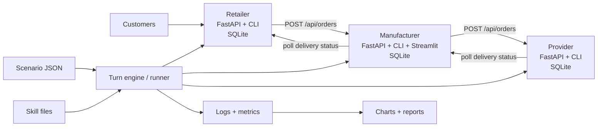
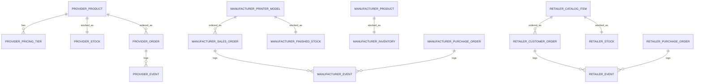

# Product Requirements Document - Autonomous 3D Printer Supply Chain

**Course:** DGSI, labs 5-8  
**Status:** final architecture for the cumulative deliverable  
**Implementation:** provider, manufacturer, retailer, turn engine, skills, scenarios, analysis.

## 1. Product Summary

The project models a 3D printer supply chain as three independent applications:

- A **provider** sells raw parts.
- A **manufacturer** buys parts, produces printers, and sells finished printers wholesale.
- A **retailer** buys printers and serves customer demand.

The system advances in simulated days. Every service owns its state, exposes a REST API and CLI, records events, supports JSON import/export, and can be orchestrated by a turn engine. Labs 6-8 extend the original Week 5 production simulator into a multi-agent business simulation with scenario signals, autonomous role skills, metrics, charts, and final analysis.

## 2. Goals

- Prove that separate supply-chain services can communicate through REST contracts.
- Keep the state of each organization isolated in its own SQLite database.
- Make time progression explicit and reproducible through a central engine.
- Capture enough event and metrics data to explain simulation outcomes.
- Use role skills to let Claude Code or Codex act as local business managers.
- Produce final reports and presentation artifacts from real runs, not hypothetical behavior.

## 3. Non-Goals

- Real payment/accounting integration.
- Authentication and multi-user deployment.
- Physical logistics beyond lead-time delays.
- Perfect economic realism.
- Replacing deterministic execution with opaque agent side effects.

## 4. Architecture

```mermaid
flowchart LR
    C[Customers] --> R[Retailer<br/>FastAPI + CLI<br/>SQLite]
    R -->|POST /api/orders| M[Manufacturer<br/>FastAPI + CLI + Streamlit<br/>SQLite]
    M -->|POST /api/orders| P[Provider<br/>FastAPI + CLI<br/>SQLite]
    P -->|poll delivery status| M
    M -->|poll delivery status| R

    E[Turn engine / runner] --> R
    E --> M
    E --> P
    S[Scenario JSON] --> E
    K[Skill files] --> E
    E --> L[Logs + metrics]
    L --> A[Charts + reports]
```

Each app is a boundary. No service writes another service's database. Cross-app state changes happen through HTTP requests and polling.

## 5. Services

### 5.1 Provider

The provider sells raw parts such as `kit_piezas`, `pcb`, `CTRL-V2`, `extrusor`, `sensor_autonivel`, cables, transformers, and plugs.

Required behavior:

- Maintain a product catalog.
- Store pricing tiers per product.
- Maintain stock per product.
- Accept manufacturer purchase orders.
- Compute tier price and expected delivery day.
- Enforce minimum lead time of one simulated day.
- Transition orders through explicit statuses.
- Log order, stock, price, market-signal, and day-advance events.
- Support restock and price-management actions for the provider agent.

### 5.2 Manufacturer

The manufacturer owns the production process and acts as the middle node.

Required behavior:

- Maintain printer models, wholesale prices, production durations, daily capacity, and BOMs.
- Receive retailer purchase orders as sales orders.
- Release sales orders to production.
- Consume BOM parts when production starts.
- Track finished-printer stock.
- Ship and deliver printer orders to the retailer.
- Buy missing parts from the configured provider.
- Poll provider orders during day advance.
- Expose a Streamlit UI for human observation.

### 5.3 Retailer

The retailer faces customer demand and creates pressure upstream.

Required behavior:

- Maintain a retail catalog and retail prices.
- Synchronize wholesale prices from the manufacturer.
- Receive customer orders generated by the engine.
- Fulfill from stock when possible.
- Backorder when stock is insufficient.
- Buy printers from the manufacturer.
- Poll manufacturer orders during day advance.
- Auto-fulfill backorders when new stock arrives.
- Keep retail price above the configured markup floor.

## 6. Data Model

The apps use different local schemas because each organization owns a different slice of the domain.

```mermaid
erDiagram
    PROVIDER_PRODUCT ||--o{ PROVIDER_PRICING_TIER : has
    PROVIDER_PRODUCT ||--|| PROVIDER_STOCK : stocked_as
    PROVIDER_PRODUCT ||--o{ PROVIDER_ORDER : ordered_as
    PROVIDER_ORDER ||--o{ PROVIDER_EVENT : logs

    MANUFACTURER_PRINTER_MODEL ||--o{ MANUFACTURER_SALES_ORDER : ordered_as
    MANUFACTURER_PRINTER_MODEL ||--|| MANUFACTURER_FINISHED_STOCK : stocked_as
    MANUFACTURER_PRODUCT ||--|| MANUFACTURER_INVENTORY : stocked_as
    MANUFACTURER_PURCHASE_ORDER ||--o{ MANUFACTURER_EVENT : logs
    MANUFACTURER_SALES_ORDER ||--o{ MANUFACTURER_EVENT : logs

    RETAILER_CATALOG_ITEM ||--o{ RETAILER_CUSTOMER_ORDER : ordered_as
    RETAILER_CATALOG_ITEM ||--|| RETAILER_STOCK : stocked_as
    RETAILER_PURCHASE_ORDER ||--o{ RETAILER_EVENT : logs
    RETAILER_CUSTOMER_ORDER ||--o{ RETAILER_EVENT : logs
```

Important tables:

- Provider: `products`, `pricing_tiers`, `stock`, `orders`, `events`, `sim_state`.
- Manufacturer: `products`, `inventory`, `printer_models`, `finished_stock`, `sales_orders`, `purchase_orders`, `events`, `sim_state`.
- Retailer: `catalog`, `stock`, `customer_orders`, `purchase_orders`, `events`, `sim_state`.

All apps expose JSON export/import of their state and events.

## 7. REST Contracts

### Provider API

| Method | Endpoint | Purpose |
|---|---|---|
| GET | `/api/catalog` | Product catalog, lead times, stock, tiers |
| GET | `/api/stock` | Current stock |
| POST | `/api/orders` | Manufacturer places a parts order |
| GET | `/api/orders` | List orders, optional status filter |
| GET | `/api/orders/{id}` | Inspect one order |
| POST | `/api/day/advance` | Advance provider day |
| GET | `/api/day/current` | Current simulated day |
| POST | `/api/market-signal` | Apply supply and lead-time modifiers |
| GET | `/api/events` | Event log |
| GET/POST | `/api/export`, `/api/import` | State transfer |

### Manufacturer API

| Method | Endpoint | Purpose |
|---|---|---|
| GET | `/api/catalog` | Printer catalog, BOMs, wholesale prices |
| GET | `/api/stock` | Raw parts inventory |
| GET | `/api/finished-stock` | Finished printer stock |
| POST | `/api/orders` | Retailer places a printer order |
| GET | `/api/orders` | List sales orders |
| POST | `/api/orders/{id}/release` | Release sales order |
| GET | `/api/production/status` | Production queue/status |
| GET | `/api/capacity` | Capacity and utilization |
| GET | `/api/providers` | Configured provider status |
| GET | `/api/providers/{supplier_name}/catalog` | Provider catalog passthrough |
| POST | `/api/purchases` | Place provider purchase order |
| GET | `/api/purchases` | List provider purchase orders |
| POST | `/api/day/advance` | Advance manufacturer day |
| GET | `/api/events` | Event log |
| GET/POST | `/api/export`, `/api/import` | State transfer |

### Retailer API

| Method | Endpoint | Purpose |
|---|---|---|
| GET | `/api/catalog` | Retail catalog and prices |
| POST | `/api/catalog/sync` | Sync wholesale prices |
| GET | `/api/stock` | Retail stock |
| POST | `/api/orders` | Customer places order |
| GET | `/api/orders` | List customer orders |
| POST | `/api/orders/{id}/fulfill` | Fulfill order |
| POST | `/api/orders/{id}/backorder` | Backorder order |
| POST | `/api/purchases` | Buy printers from manufacturer |
| GET | `/api/purchases` | List manufacturer purchases |
| POST | `/api/day/advance` | Advance retailer day |
| GET | `/api/events` | Event log |
| GET/POST | `/api/export`, `/api/import` | State transfer |

## 8. Time and Turn Design

The engine is the only component that coordinates time across apps. A valid turn:

1. Reads the current day and validates that apps are aligned.
2. Loads the scenario signal for the day.
3. Applies provider market modifiers.
4. Generates deterministic customer demand and posts it to the retailer.
5. Runs role decisions.
6. Advances all apps.
7. Saves metrics and a narrative trace.

The extended Week 8 runner uses multiplicative composition for overlapping events:

- Combined demand modifier = product of active event demand modifiers.
- Combined supply modifier = product of active event supply modifiers.
- Combined lead-time modifier = product of active event lead-time modifiers.

This makes the overlap of chip shortage and Christmas rush materially different from either event alone.

## 9. Agent Design

The system uses one skill per role:

- `skills/provider-manager.md`
- `skills/manufacturer-manager.md`
- `skills/retail-manager.md`

Skill design principles:

- Make the role local, not omniscient.
- Provide exact commands and forbid `day advance`.
- Ask for concise reasoning and a final end-of-day summary.
- Prefer precomputed action hints from the runner for long simulations.
- Keep mutations auditable through CLI/API calls and event logs.

The final skills were shortened after early tests because broader exploratory prompts consumed too many turns. The current skills use a fast path: the runner collects state and provides recommended commands, then the role agent executes the action or reports that no action is needed.

## 10. Scenarios and Metrics

Required scenarios:

- `calm-market.json`: stable control period.
- `holiday-rush.json`: volatile market with Black Friday, chip shortage, and Christmas rush.

Metrics captured per day include:

- Provider stock, prices, and order status counts.
- Manufacturer raw stock, finished stock, wholesale prices, capacity utilization, sales order status, and purchase order status.
- Retailer stock, retail prices, customer orders placed/fulfilled/backordered, and purchase order status.

The charting script produces:

- Inventory over time.
- Prices over time.
- Order fulfillment bars.
- Event overlays.
- Scenario comparison.
- Per-role detail charts.

## 11. Final Deliverables

The repository must include:

- Source for all three apps.
- Seed data for all three apps.
- The deterministic and extended turn engines.
- The three skill files.
- At least two scenario files.
- Final `CLAUDE.md`, this PRD, README, and `.gitignore`.
- Logs, charts, and presentation artifacts for analysis.
- Markdown reports for labs 6, 7, and 8.
- A merged PDF generated from the markdown reports with pandoc and mermaid-filter.

## 12. Known Constraints

- SQLite is sufficient for local simulation but not designed for high-write concurrent production workloads.
- The long autonomous run can be slow when role agents are invoked sequentially.
- Logs are intentionally excluded from git because they can become large; report charts are committed as compact evidence.
- The current long-run evidence includes a 15-day calm run and a 25-day volatile run.
