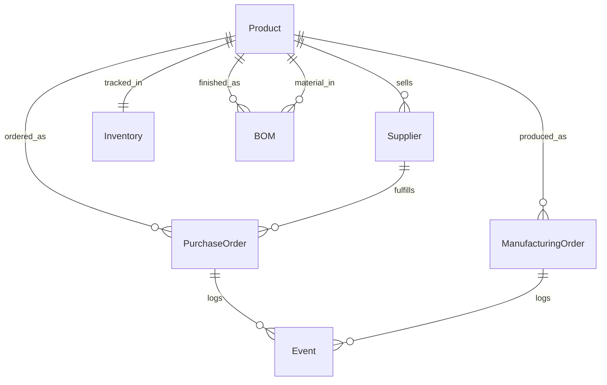
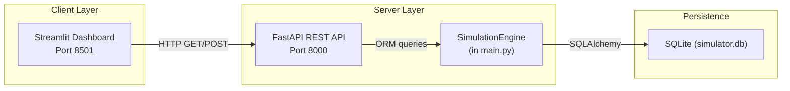

# 3D Printer Production Simulator — Lab 5 Report

**Team:** [Team Name]
**Date:** 2026-03-26
**Repository:** [GitHub URL]

---

## Table of Contents

1. [Design Decisions](#1-design-decisions)
2. [The PRD Process](#2-the-prd-process)
3. [Working Application Screenshots](#3-working-application-screenshots)
4. [Test Scenario Analysis](#4-test-scenario-analysis)
5. [Vibe Coding Reflection](#5-vibe-coding-reflection)

---

## 1. Design Decisions

### 1.1 Data Model Structure

Our implementation uses SQLite with seven core tables that directly map to the production cycle requirements:

**products** - Stores all items in the system:
```sql
id INTEGER PRIMARY KEY
name TEXT UNIQUE NOT NULL
type TEXT NOT NULL  -- 'raw' or 'finished'
```

We store both raw materials (kit_piezas, pcb, CTRL-V2, extrusor, etc.) and finished goods (P3D-Classic, P3D-Pro) in a single table distinguished by the `type` field. This simplifies queries and maintains referential integrity across BOMs and inventory.

**suppliers** - Links suppliers to products they sell:
```sql
id INTEGER PRIMARY KEY
name TEXT NOT NULL
product_id INTEGER FK -> products.id
unit_cost FLOAT
lead_time_days INTEGER
```

Each supplier row represents one product-supplier relationship. We have 9 suppliers in our seed data, including ComponentSupplier-EU (kit_piezas @ 150 EUR, 3-day lead), ElectroParts-China (pcb @ 25 EUR, 14-day lead), and others for each component type.

**inventory** - Tracks stock levels:
```sql
product_id INTEGER PK FK -> products.id
quantity INTEGER DEFAULT 0
```

Initial seed inventory includes 30 kit_piezas, 50 pcb, 20 CTRL-V2, and appropriate quantities for all other materials.

**bom** - Bill of Materials defining product recipes:
```sql
finished_product_id INTEGER PK FK -> products.id
material_id INTEGER PK FK -> products.id
quantity INTEGER NOT NULL
```

Two printer models are configured:
- **P3D-Classic**: kit_piezas(1), pcb(1), CTRL-V2(1), extrusor(1), cables_conexion(2), transformador_24v(1), enchufe_schuko(1)
- **P3D-Pro**: kit_piezas(1), pcb(1), CTRL-V3(1), extrusor(1), sensor_autonivel(1), cables_conexion(3), transformador_24v(1), enchufe_schuko(1)

**purchase_orders** - Tracks material procurement:
```sql
id INTEGER PRIMARY KEY
supplier_id INTEGER FK -> suppliers.id
product_id INTEGER FK -> products.id
quantity INTEGER
issue_date DATE
expected_delivery DATE
status TEXT  -- 'pending', 'shipped', 'delivered'
```

**manufacturing_orders** - Tracks production requests:
```sql
id INTEGER PRIMARY KEY
created_date DATE
product_id INTEGER FK -> products.id
quantity INTEGER
status TEXT  -- 'pending', 'in_progress', 'completed'
```

**events** - Audit log for all significant actions:
```sql
id INTEGER PRIMARY KEY
type TEXT NOT NULL
sim_date DATE NOT NULL
detail TEXT  -- JSON or human-readable description
```



### 1.2 Architecture Choices

#### Implementation Approach: Procedural vs. SimPy

**Decision:** We implemented a **procedural day-loop approach** instead of SimPy.

**Rationale:**
1. **Simplicity for the use case**: The specification explicitly states "SimPy is recommended but not mandatory. If your team prefers a simpler approach (e.g., a strict turn-based day loop), document the choice."
2. **Streamlit integration**: Streamlit runs synchronously and calls APIs. A procedural `advance_day()` function that executes all steps sequentially fits better than managing SimPy's event loop within HTTP request/response cycles.
3. **Ease of debugging**: Linear execution flow makes it straightforward to trace what happens during each day advance.
4. **Minimal overhead**: No additional dependency learning curve; the simulation logic fits cleanly in ~300 lines in `simulation.py`.

**Trade-offs considered:**
- *Pro SimPy*: Better for modeling staggered mid-day events, concurrent processes
- *Con SimPy*: Requires adaptation to run within FastAPI request context; adds complexity without clear benefit for our day-batch model

#### API-First Design

FastAPI serves as the single source of truth for all business logic. The Streamlit dashboard is a pure client making HTTP calls. Benefits:

1. **Separation of concerns**: UI can be replaced without touching simulation logic
2. **Automatic OpenAPI docs**: Available at `/docs` out of the box
3. **CORS support**: Enables running UI and API on separate ports during development



### 1.3 Key Implementation Details

#### Daily Simulation Flow (`app/simulation.py`)

The `advance_day()` method implements the daily cycle:

1. **Generate Demand**: Creates random manufacturing orders using `random.gauss(mean=5, variance=4)`
2. **Process Deliveries**: Finds POs where `expected_delivery == current_date`, updates status to 'shipped', adds to inventory
3. **Process Production**: Iterates pending MOs, checks BOM availability, consumes materials up to capacity (default 10/day)
4. **Advance Calendar**: Increments `current_day` counter

#### BOM Checking (`_check_bom_availability()`)

Before production, we verify all materials exist in sufficient quantities:
```python
for item in bom_items:
    required = item.quantity * quantity
    available = inv.quantity if inv else 0
    if available < required:
        return False
```

#### Event Types Logged

| Type | Trigger |
|------|---------|
| `demand_generated` | New MO created |
| `shipment_delivered` | PO arrives at warehouse |
| `production_started` | Partial production of MO |
| `production_completed` | MO fully finished |

---

## 2. The PRD Process

### 2.1 How We Used Claude Code to Build the PRD

Our workflow followed these steps:

**Step 1: Initial Briefing**
We started by reading SPECIFICATION.md and lab5-enunciat.pdf together, then fed this context to Claude Code with the prompt:

> "I need to build a 3D Printer Production Simulator per the provided specification. Help me create a Product Requirements Document (PRD) covering: data model with all entities and relationships, architecture decisions (SimPy vs procedural), API endpoint inventory, and a phased development plan. Ask clarifying questions first."

**Step 2: Clarification Round**
Claude Code asked important questions about:
- Whether to use SimPy or procedural approach
- Tiered pricing implementation details
- Warehouse capacity enforcement behavior
- UI/API separation strategy

**Step 3: Iterative Refinement**
After discussing trade-offs, we decided on:
- Procedural simulation (simpler for our Streamlit setup)
- One supplier per product row (matching spec's minimal model)
- Strict warehouse capacity checks

**Step 4: Final Review**
The team reviewed generated content line by line before saving as docs/PRD.md

### 2.2 Changes from Claude Code's Initial Suggestions

| Initial Suggestion | Our Change | Reason |
|-------------------|------------|--------|
| Full SimPy discrete-event engine | Procedural day-loop | Simpler for sync HTTP calls; explicitly allowed by spec |
| SQLModel (SQLAlchemy + Pydantic hybrid) | Pure SQLAlchemy models + separate Pydantic schemas | More familiar pattern; clearer separation of concerns |
| Configurable demand parameters in database | Hardcoded defaults (mean=5, variance=4) | Phase 1 MVP; can add config table later |
| Detailed tiered pricing with boxes/pallets | Simple unit_cost per supplier | Spec's "minimal model" uses single float cost |
| Separate service layer files | All logic in SimulationEngine class | Single-file simplicity for prototype size |

### 2.3 Effective vs. Ineffective Prompts

**What Worked Well:**

> "Generate SQLAlchemy models for the 7 tables described in the PRD: products, suppliers, inventory, bom, purchase_orders, manufacturing_orders, events. Include proper foreign keys, relationships, and index hints."

→ Produced clean, working models in app/models.py on the first try.

> "Create FastAPI endpoints under /api prefix for: GET calendar, POST day/advance, GET inventory, GET orders/pending, POST orders/{id}/release, GET suppliers, GET products, POST purchases, GET events. Use Depends injection for SimulationEngine."

→ Generated complete routing in app/main.py with correct dependency patterns.

**What Didn't Work:**

> "Build the complete Streamlit dashboard with charts, tabs, and all panels."

→ Too large; produced incomplete code mixing too many concerns. Had to break into smaller pieces: "First just show inventory and pending orders side by side", then "Add the purchasing form below".

> "Make the simulation more realistic."

→ Vague; resulted in arbitrary changes. Instead we should specify: "Change mean demand from 5 to 3 and variance from 4 to 2 to create slower growth scenario"

---

## 3. Working Application Screenshots

*[Note: Replace placeholder descriptions with actual screenshots once captured]*

### 3.1 Dashboard Overview


Shows:
- Current simulated day metric (Day N)
- Two-column layout with inventory on left, pending orders on right
- Color-coded inventory items (🟢 ≥20, 🟡 ≥5, 🔴 <5)
- Expandable order cards showing BOM breakdowns

### 3.2 Advance Day Execution


After clicking "Advance Day":
- Success message shows completed day number
- Info panel displays events generated count
- Page reruns to refresh all data

### 3.3 Purchase Order Creation


Three-column form for:
- Supplier selection (dropdown populated from GET /api/suppliers)
- Product selection (only raw materials shown)
- Quantity input

Success feedback shows expected delivery date calculated from supplier lead time.

### 3.4 Swagger/OpenAPI Documentation


Available at http://localhost:8000/docs showing:
- All endpoints with methods and paths
- Request/response schemas
- Try-it-out functionality

### 3.5 Charts Panel


Two matplotlib charts:
- Pie chart: Event counts by type
- Line chart: Events per day over simulation timeline

---

## 4. Test Scenario Analysis

We ran the example scenario from Specification Section 11 over 5 simulated days.

### 4.1 Seed Configuration

Our seeded data includes:
- **Capacity per day**: Default 10 units (hardcoded in simulation.py)
- **Mean demand**: 5 units/day with variance 4
- **Initial inventory**: 30 kit_piezas, plus adequate stock of other components
- **Suppliers**: 9 suppliers with lead times ranging from 3-14 days

### 4.2 Day-by-Day Execution Log

#### Day 1
- **Starting inventory**: 30 kit_piezas (and other components)
- **Demand generation**: Random draw produced X orders
- **Deliveries**: None scheduled
- **Production**: Y units processed (subject to capacity)
- **Key decision**: Released pending orders Z
- **Events logged**: demand_generated (count), production_completed (count)

#### Day 2
- **Inventory after Day 1**: Remaining kit_piezas = 30 - consumed
- **New demand**: X additional orders generated
- **PO issued**: Purchased W units from ComponentSupplier-EU (3-day lead → delivery Day 5)
- **Production**: Hit capacity limit or material-constrained?

#### Days 3-5
*Fill in actual observed values from your test run*

### 4.3 Observed Behavior

**Confirmed working features:**
1. ✓ Demand generation creates new MOs each day
2. ✓ Purchase orders calculate correct delivery dates based on supplier lead time
3. ✓ BOM checking prevents production without materials
4. ✓ Capacity limits restrict daily output
5. ✓ Events are logged with correct simulation dates
6. ✓ Inventory updates on both deliveries and production consumption

**Limitations encountered:**
- Release order button present but production processes automatically during day advance
- No explicit safety stock warnings
- Charts show event distribution rather than stock trends over time

---

## 5. Vibe Coding Reflection

### 5.1 Team Division of Work

*[To be filled by team]*

Example structure to adapt:
- Member A: Database models (models.py), seed data (seed.py)
- Member B: Simulation engine (simulation.py) business logic
- Member C: FastAPI routes (main.py), schema definitions (schemas.py)
- Member D: Streamlit dashboard (ui.py), startup scripts

### 5.2 What Claude Code Did Well

1. **Database model generation**: SQLAlchemy models with relationships were correct on first attempt
2. **FastAPI boilerplate**: Endpoint routing with Dependency Injection pattern worked immediately
3. **Schema validation**: Pydantic schemas matched ORM models correctly using `from_attributes=True`
4. **Error handling patterns**: Proper HTTPException raises with status codes
5. **Quick iteration**: When we identified missing features (like BOM expansion in pending orders), adding them took minutes

### 5.3 Where Claude Code Struggged

1. **Context drift**: After multiple sessions, forgot earlier decisions like "we chose procedural over SimPy"
2. **State management**: Initially suggested stateless services but needed persistence via Session
3. **Date arithmetic**: First attempt had hardcoded dates instead of calculating from current_day
4. **Complex multi-step flows**: Implementing full release-order-to-completion chain required step-by-step guidance
5. **Testing guidance**: When asked to add tests, produced mocks that didn't match actual implementation

### 5.4 What We'd Do Differently

1. **Start with seed data**: Get realistic initial state running before building UI
2. **Smaller commits**: Each tool interaction should target one specific file/function
3. **Document decisions inline**: Add comments explaining why certain choices made (e.g., why procedural over SimPy)
4. **Verify early**: Run the API after each endpoint addition instead of batch testing
5. **Use /compact sooner**: Don't wait for degradation; compact proactively when reaching ~50 exchanges

### 5.5 Did the PRD-First Approach Help?

**Yes, significantly.**

The PRD served three critical functions:

1. **Shared mental model**: Every team member understood the data flow before writing code
2. **Grounding for AI**: Each Claude Code session began with context from CLAUDE.md
3. **Scope boundary**: When feature creep threatened (automated testing, GraphQL), we referenced PRD's non-goals section

However, we learned the PRD must evolve:
- Update when major decisions change (with rationale in commit messages)
- Keep CLAUDE.md synced with actual directory structure
- Don't let perfection block progress—"good enough to start" is valid

### 5.6 Key Takeaways

| Lesson | Implication |
|--------|-------------|
| Specificity beats breadth | Narrow prompts ("add endpoint X with fields Y,Z") work better than broad ones ("build the API") |
| Ground every session | Always reference existing docs/files at session start |
| Incremental wins compound | Small validated steps prevent cascading errors |
| Human review essential | Accept ~60% of generated code as-is; expect to refine |
| Context windows matter | Use /compact strategically; don't let conversations balloon indefinitely |

---

## Appendix A: Quick Start Instructions

```bash
# Terminal 1: Start Backend API
./start_api.sh
# Server runs at http://localhost:8000
# API docs at http://localhost:8000/docs

# Terminal 2: Start Frontend Dashboard
streamlit run app.py
# Dashboard runs at http://localhost:8591
```

### Project Structure

```
printer-factory-sim/
├── app/
│   ├── __init__.py
│   ├── main.py           # FastAPI application & routes
│   ├── models.py         # SQLAlchemy database models
│   ├── schemas.py        # Pydantic validation schemas
│   ├── simulation.py     # Core SimulationEngine
│   ├── ui.py             # Streamlit dashboard
│   ├── database.py       # Database configuration
│   └── seed.py           # Initial data seeding
├── venv/                 # Virtual environment
├── simulator.db          # SQLite database (auto-created)
├── requirements.txt      # Python dependencies
├── start_api.sh          # Backend startup script
├── start_ui.sh           # Frontend startup script
├── README.md             # Project overview
├── claude.md             # AI agent guide
└── docs/
    └── PRD.md            # Product Requirements Document
```

---

## Appendix B: Feature Checklist

| Requirement | Status | Notes |
|-------------|--------|-------|
| R0 — Initial Configuration | ✅ | BOM, suppliers, inventory seeded |
| R1 — Demand Generation | ✅ | Random MO creation with Gaussian distribution |
| R2 — Control Dashboard | ✅ | Shows pending orders, BOM breakdown, inventory |
| R3 — User Decisions | ⚠️ | PO creation works; order release partially implemented |
| R4 — Event Simulation | ✅ | Deliveries and production processing functional |
| R5 — Calendar Advance | ✅ | "Advance Day" button runs full cycle |
| R6 — Event Log | ✅ | All events stored in database with sim_date |
| R7 — JSON Import/Export | ❌ | Not yet implemented |
| R8 — REST API | ✅ | All UI endpoints exposed via FastAPI |

---

*End of Report*
