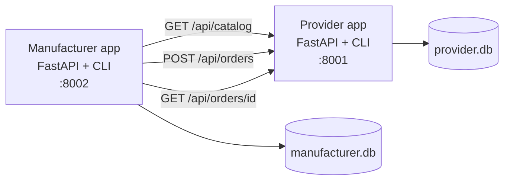

# Lab 6 Report - Two Apps Talking

## A. System Architecture

Lab 6 moved the Week 5 factory simulator from a single-app production planner into the first distributed version of the supply chain. The goal was deliberately narrow: build a provider app, keep it as an independent process with its own database, and teach the manufacturer to buy raw parts through a REST contract instead of reaching into the provider's state.



The provider is responsible for catalog, pricing tiers, stock, order lifecycle, and event history. The manufacturer remains responsible for its own raw-parts inventory and keeps a local purchase order record for every remote provider order. This duplication is intentional: the provider owns the seller's view of the transaction, while the manufacturer owns the buyer's view and needs to know what is in flight.

The main design decision was to use separate FastAPI apps instead of a shared Python module. That made the boundary explicit and forced the same integration pattern that real companies use: request, response, status polling, and error handling. The cost is more operational work because both services must be running and their simulated calendars must stay aligned.

### Provider REST Contract

The provider contract was designed around the minimum actions the manufacturer needs:

| Method | Endpoint | Reason |
|---|---|---|
| `GET` | `/api/catalog` | Manufacturer can discover product IDs, lead times, stock, and price tiers. |
| `GET` | `/api/stock` | Humans and agents can inspect available supplier capacity. |
| `POST` | `/api/orders` | Manufacturer places a parts order with buyer, product, and quantity. |
| `GET` | `/api/orders` | Used for status lists and debugging. |
| `GET` | `/api/orders/{id}` | Manufacturer polls one remote order until delivered. |
| `POST` | `/api/day/advance` | Provider processes transitions for one simulated day. |
| `GET` | `/api/day/current` | Turn alignment check. |
| `GET` | `/api/events` | Audit trail and debugging evidence. |

When an order is created, the provider checks stock immediately, picks the correct tier price, subtracts the quantity from its own stock, computes `expected_delivery_day`, and writes `order_placed` plus `stock_updated` events. The lifecycle then advances through `pending`, `confirmed`, `in_progress`, `shipped`, and `delivered` during provider day advancement.

### Manufacturer Changes

On the manufacturer side, the important addition was `ProviderClient`, which wraps HTTP calls to the provider. The manufacturer now has provider config in `manufacturer/config.json`, CLI commands such as `suppliers catalog`, `purchase create`, and `purchase list`, and local purchase order rows that store the remote provider order ID. During `manufacturer/app/services.py::advance_day`, open purchases are polled from the provider and delivered parts are added to local inventory.

This polling design was chosen over provider push notifications. Polling is less elegant but much simpler for a lab environment: it avoids callbacks, firewalls, retry queues, and cross-service subscriptions. For a day-based simulation, polling once per day is also semantically clear.

## B. Agent Design

Lab 6 did not require autonomous agents yet. The important agent-related design work was to make the future agent interface simple and consistent. Both apps expose CLIs, and the commands use the same nouns that appear in the REST API:

```bash
./provider/start_cli.sh catalog
./provider/start_cli.sh stock
./provider/start_cli.sh orders list
./provider/start_cli.sh day advance

./manufacturer/start_cli.sh suppliers list
./manufacturer/start_cli.sh suppliers catalog "ChipSupply Co"
./manufacturer/start_cli.sh purchase create --supplier "ChipSupply Co" --product pcb --qty 50
./manufacturer/start_cli.sh purchase list
```

That CLI consistency matters because Week 7 and Week 8 role skills later depend on exact commands. The Lab 6 implementation therefore created the operational vocabulary that the agents would use: catalog inspection, stock inspection, purchase creation, order status checks, and day advancement.

The main constraint established here was also the most important later rule: role actors must not advance time on their own. The simulation day should be advanced by a human in Lab 6 and by a turn engine later.

## C. Simulation Results

The Lab 6 verification scenario was the five-day provider/manufacturer flow:

1. Start provider on port `8001` and manufacturer on port `8002`.
2. Confirm that the provider has stock and a tiered catalog.
3. Place a manufacturer purchase order for provider parts.
4. Advance provider and manufacturer in the same order each day.
5. Confirm the order becomes delivered remotely and the manufacturer receives inventory.

The repository supports this scenario through the app CLIs and the smoke script:

```bash
./scripts/check_supply_chain.sh
```

The most important behavior is not that the order exists, but that both databases tell the same story from their own side. The provider records the order as seller history and decrements supplier stock. The manufacturer records an inbound purchase order and only increases local inventory after polling a delivered provider order. This avoids the common distributed-system mistake of assuming that a successful remote order means the materials have already arrived.

The lead-time rule is also enforced: parts ordered today do not arrive today. The provider computes delivery as current day plus effective lead time, with a minimum of one day. This is what creates planning pressure for later labs.

## D. Vibe-Coding Reflection

Claude Code was most useful in Lab 6 for generating the repeated scaffolding: FastAPI endpoints, Typer CLI wrappers, SQLAlchemy models, and serialization methods. The pattern was clear enough that the agent could extend it without needing major architectural invention.

The parts that needed human correction were the distributed-system boundaries. Early suggestions tended to blur responsibility by sharing logic too directly or by making the manufacturer assume provider state. We corrected that by keeping databases separate and forcing all cross-app communication through HTTP.

The other lesson was that event logs are not optional. Without provider and manufacturer events, a failed order looks like a black box. With events, we can reconstruct whether the order failed at stock check, shipment, polling, or local receipt. That audit trail became essential in Week 8 when many more orders and agents were active.

If we restarted Lab 6, the main improvement would be to write an automated five-day scenario test earlier. Manual CLI verification is fine for the first pass, but the moment the retailer and engine were added, repeatable smoke checks became more valuable than ad hoc terminal history.

