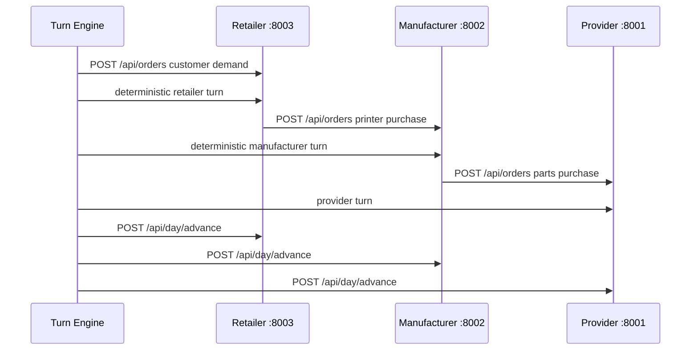

# Lab 7 Report - Retailer, Turn Engine, and First Skill

## A. System Architecture

Lab 7 completed the three-app supply chain and introduced orchestration. The new app was the retailer, which receives customer demand, fulfills from stock, backorders when necessary, and buys finished printers from the manufacturer. The new script was the turn engine, which advances all services in lock-step instead of relying on a human to type commands in three terminals.



The architecture now has a downstream demand source and a complete upstream reaction path:

- Customer orders pressure the retailer.
- Retailer purchase orders pressure the manufacturer.
- Manufacturer part orders pressure the provider.
- Provider lead times and stock limits constrain the whole chain.

The retailer is intentionally built like the other apps: FastAPI, Typer CLI, SQLite, seed data, event log, day counter, and JSON import/export. Its key endpoints are `/api/catalog`, `/api/stock`, `/api/orders`, `/api/purchases`, and `/api/day/advance`. The retailer also has `/api/catalog/sync`, which pulls wholesale prices from the manufacturer so retail price rules can enforce a markup over the current upstream price.

### Turn Engine Design

The deterministic Week 7 engine lives in `scripts/turn_engine.py`. It reads `scenarios/week7.json`, validates the current day, generates customer orders from a demand model, runs simple role policies, advances apps, and writes a JSONL record to `logs/turn-engine.jsonl`.

The chosen turn order is downstream pressure first, then upstream reaction:

1. Generate customer orders at the retailer.
2. Retailer processes pending customer orders and reorders printers if stock is below target.
3. Manufacturer releases pending sales orders and orders missing BOM parts.
4. Provider observes open orders.
5. All apps advance one day.

This order was chosen because it creates a clear causal chain. Demand appears at the customer edge first. The retailer reacts by ordering printers. The manufacturer reacts by releasing production and buying parts. The provider then handles its own order lifecycle. The day advance is centralized so no role can accidentally move time twice.

## B. Agent Design

The first skill file was `skills/manufacturer-manager.md`. The manufacturer was the best first role because it touches both directions of the chain: retailer orders downstream and provider purchases upstream.

The skill's core responsibilities are:

- Review incoming retailer orders.
- Check raw material and finished-printer stock.
- Release sales orders to production when possible.
- Order parts from suppliers when stock or projected demand requires it.
- Adjust wholesale prices when utilization and backlog become high.
- Never call `day advance`.

Two skill-authoring decisions mattered most:

1. **The skill names exact commands.** The agent is not asked to invent a command vocabulary. It gets commands such as `./manufacturer/start_cli.sh sales orders`, `production release`, `purchase create`, and `price set`.
2. **The skill forbids time advancement.** This prevents the classic orchestration failure where an enthusiastic role agent finishes its work and calls `day advance`, causing the global simulation to skip or desynchronize.

The later Week 8 skill is shorter than the initial Lab 7 draft, but the Lab 7 lesson remained: the agent needs a clear role, a command surface, constraints, and a required summary. Without the summary, the raw output is difficult to audit. With it, the engine can store one file per role per day and the team can inspect what happened.

## C. Simulation Results

The Lab 7 baseline scenario is `scenarios/week7.json`. It defines three days of demand with normal, bump, and quiet signals. The engine can be run with:

```bash
python3 scripts/turn_engine.py --scenario scenarios/week7.json --days 3
```

The expected result is not a polished autonomous economy yet. The goal is plumbing:

- Customer demand is inserted into the retailer.
- Retailer orders are visible in the manufacturer.
- Manufacturer can release production and create provider purchases.
- Provider receives parts orders.
- All apps move to the next simulated day together.
- Events across the three services form a coherent trace.

The repo also contains agent-check logs in `logs/skill-manufacturer-check.log`, `logs/skill-provider-check.log`, and `logs/skill-retailer-check.log`. Those files are useful evidence that the skill format was tested in isolation before the full Week 8 run.

The most useful failure mode in Lab 7 was command ambiguity. If a skill said "review stock and buy what is needed," the model could spend time listing data or choose the wrong command. When the skill specified exact commands and a fixed decision order, output became more predictable. This is why the final skill files evolved toward fast-path actions and explicit end-of-day summaries.

## D. Vibe-Coding Reflection

Claude Code was strong at repeating the established service pattern from Lab 6. Once provider and manufacturer had clear FastAPI/CLI/service/database layers, the retailer could be scaffolded quickly. The AI also helped create the initial turn engine skeleton because the orchestration algorithm was easy to express in natural language.

The weaker area was multi-process reasoning. A local function call and a remote HTTP call can look similar in code, but they have very different failure modes. The team had to keep asking: which app owns this state, which API is the contract, and what happens if the upstream service is down?

The PRD-first approach helped because it prevented the retailer from becoming just another table inside the manufacturer. We had already committed to separate processes and event logs, so when the third app arrived, the architecture had a place for it.

If we started Lab 7 again, we would add log capture from the first engine run immediately. The statement explicitly says agent output should be stored, not just printed, and the later analysis work proved why: once a run has 15 or 25 days, terminal scrollback is not evidence.

The main successful outcome of Lab 7 was that autonomy had a stable place to attach. By the end, the software was no longer only three services; it was a world with a clock, customer demand, role turns, state transitions, and an audit trail.

