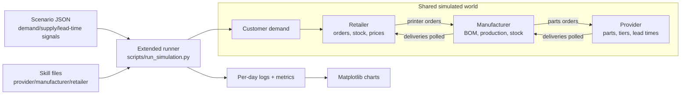
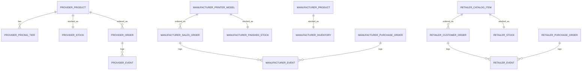

# Lab 8 Report - Autonomous Supply Chain and Analysis

## A. System Architecture

Lab 8 completed the three-week arc: all three roles have skill files, the scenarios include real market pressure, and the simulation produces logs and charts that can be analyzed after the run. The final system keeps execution deterministic where correctness matters and uses role skills where business decisions are needed.

The final runner is `scripts/run_simulation.py`. It reads a scenario, applies the day signal, injects customer orders, runs the three role turns, advances all apps, and writes metrics. The scenario merge rule for overlapping events is multiplicative. For example, during the overlap of chip shortage and Christmas rush, demand and lead-time modifiers compound instead of replacing one another. This makes days 18-20 of `holiday-rush` the strongest stress period.

The service boundaries stayed the same as Lab 7:

- Provider owns part stock, tier prices, lead times, and provider orders.
- Manufacturer owns raw inventory, printer models, BOMs, production, finished stock, and retailer sales orders.
- Retailer owns customer demand, retail stock, backorders, purchases from manufacturer, and retail prices.

The final PRD in `docs/PRD.md` now reflects this system rather than the original Week 5 single-factory app.

### Data Model

The apps do not share one universal schema because they represent different organizations. This was a good trade-off: it avoids coupling, but it means the turn engine and reports must normalize metrics across different local models.

## B. Agent Design

The final skill set contains:

- `skills/provider-manager.md`
- `skills/manufacturer-manager.md`
- `skills/retail-manager.md`

The provider skill manages restocking and supplier price changes. It watches stock against starting thresholds and reacts to shortage signals with controlled price increases. The manufacturer skill manages order release, part purchasing, and wholesale price increases when backlog or utilization is high. The retail skill processes customer orders, backorders unmet demand, creates printer purchases, and adjusts retail prices while respecting the wholesale markup floor.

The first versions of the skills were too exploratory. They asked the agent to inspect state, reason, choose commands, and act. That worked for one-day demos but became slow and brittle in long simulations. The final skills use a fast path: the runner provides current state plus an `ACTION HINT`, and the role executes recommended commands or reports no action. This preserved the educational idea of role skills while keeping long runs auditable and short enough.

One important rewrite was the provider behavior. The Lab 8 statement explicitly warns that provider stockouts can cascade. The skill therefore gained rules about restocking products below threshold and limiting daily price changes. Another rewrite was the retailer behavior. The retailer has to process every pending order, otherwise the backlog state becomes misleading. The final retail skill starts with `process-orders` and then places purchases sized against backlog and buffer.

What the agents are good at:

- Following explicit command hints.
- Writing readable summaries of why they acted.
- Applying simple threshold rules.
- Keeping local decisions separated by role.

What they are bad at:

- Discovering the right command in a large CLI surface without help.
- Planning several lead times ahead unless the prompt makes that look-ahead explicit.
- Balancing price, service level, and stock without turning the rule into a concrete action.

## C. Simulation Results

Two scenarios were used for analysis:

- `calm-market`: stable control run, 15 logged days.
- `holiday-rush`: volatile run, 25 logged days with normal demand, Black Friday, chip shortage, and Christmas rush.

The generated evidence is stored as metrics logs in `logs/` and charts in `reports/`.

The dashboard summarizes the full 25-day holiday-rush run across all three roles. Inventory, prices, and order fulfillment all show the signature of a stressed supply chain.

**Inventory** starts under pressure and never fully recovers at the retail level. Retail stock begins at 8 units and repeatedly hits zero. Manufacturer raw stock dips to a minimum of 57 units during the stressed middle days, then recovers to 295 by day 25 as provider deliveries catch up. This late recovery is delayed, not anticipatory.

**Prices** rise persistently across all roles. Retail prices for the three printer models reach `1100.14`, `780.04`, and `1936.86` by day 25. Wholesale prices follow with values of `546.67`, `367.73`, and `957.79`. Provider tier prices increase on constrained parts — `kit_piezas` tier 10 rises from `135.0` to `171.52`, and `transformador_24v` tier 50 from `18.0` to `23.96`. The movement is a sustained escalation in response to backlog, not oscillation.

**Orders** tell a similar story. The run receives 212 customer orders over 25 days, fulfills 164, and ends with 48 backordered. The largest demand peak is day 20, with a catch-up burst of 38 fulfilled orders driven by stock that had accumulated from earlier upstream activity.

For more detail on each role individually, the per-role breakdown charts are available in the `reports/` folder: `holiday-rush_manufacturer_detail.png`, `holiday-rush_provider_detail.png`, and `holiday-rush_retailer_detail.png`.

---

The comparison chart puts the calm-market and holiday-rush runs side by side. The calm run is a useful baseline: 80 customer orders over 15 days, 59 fulfilled, with stable prices and gradual stock depletion. Compared to the holiday run, the difference in scale and volatility is immediately visible. Retail prices in the holiday scenario end up roughly double those of the calm run, and the order volume is more than twice as large. The calm run shows that the system is already under-provisioned at baseline — the holiday events do not create a different kind of failure, they amplify the same structural weakness.

### Event Overlay and Causal Chain

The event phases explain the shape of the volatile run:

- Days 1-7: normal demand still drains retailer stock because starting inventory is small.
- Days 8-12: Black Friday increases demand before enough finished printers can arrive.
- Days 13-20: chip shortage reduces supplier effectiveness and extends lead times.
- Days 18-20: chip shortage and Christmas overlap, multiplying the stress.
- Days 21-25: Christmas demand remains high, but prices and recovered upstream stock dampen the later collapse.

The most visible emergent behavior is a bullwhip pattern, unfolding in three compounding phases.
During days 1–7, both the retailer and the manufacturer operate under normal demand assumptions. Neither agent accumulates a sufficiently large safety stock: the retailer keeps minimal printer inventory, and the manufacturer does not pre-build finished units in anticipation of a surge. When Black Friday hits on day 8, demand spikes abruptly and neither agent is prepared.

This triggers a reactive scramble. The retailer, facing stockouts, places aggressively large orders on the manufacturer. The manufacturer, in turn, scales up production and issues oversized part orders to the provider, each printer requiring multiple components, so even a moderate increase in production targets translates into a disproportionately large upstream parts order, further inflated by safety-stock logic trying to compensate for the accumulated backlog. The upstream signal is already a distorted, magnified version of the original retail demand shock.

Then, on day 13, the chip shortage hits. Precisely when the manufacturer is placing its largest part orders, supplier lead times extend and delivery rates drop. The incoming parts flow slows just as production pressure peaks, making it impossible for the manufacturer to clear the backlog through output. The two stressors (demand surge and supply disruption) overlap and multiply: the retailer's stockouts persist not just because demand is high, but because the upstream pipeline has seized up at the worst possible moment.

By days 18–20, Christmas demand compounds the already unresolved Black Friday backlog. Only after day 21, as the chip shortage eases and previously-placed large orders finally arrive, does the manufacturer's raw-parts stock begin to recover. Critically, this upstream recovery is not a sign of restored equilibrium, it is evidence of order inertia: panic-driven purchases placed during peak stress keep arriving even as downstream demand begins to normalize, setting the stage for a potential overstock correction in subsequent periods.

### Required Questions

**Did the manufacturer build stock ahead of Black Friday?**  
Only partially. It reacted to retailer demand and released orders, but the system did not intentionally prebuild enough finished-printer stock before day 8. Retail stock reached zero during the early stress period, so preparation was reactive rather than anticipatory.

**When stockouts happened, whose decision was proximate and whose was root cause?**  
The proximate cause was retailer exposure: starting stock was too low for the incoming demand and reorder lead times. The root cause was system-wide planning latency: the manufacturer and provider reacted after demand became visible, and the compounded lead times meant upstream correction arrived late.

**Did prices stabilize or oscillate?**  
Prices mostly trended upward. Retail and wholesale prices rose as backlog persisted; provider prices increased on constrained tiers. The run shows damped escalation rather than a price war or collapse.

**Can we identify a bullwhip moment?**  
Yes. The day 8-20 demand shock becomes larger upstream as retailer backorders create printer orders and printer orders expand into BOM part purchases. The later recovery of manufacturer raw stock while backorders still exist is the signature: upstream inventory movement is amplified and delayed relative to the original customer demand.

## D. Vibe-Coding Reflection

Across Labs 6-8, Claude Code was most valuable when the architecture was already explicit. It generated repeated service patterns quickly, helped wire APIs and CLIs, and made it easier to evolve the same idea across provider, manufacturer, and retailer.

It struggled when asked to solve a hole big problem at once. "Build the autonomous simulation" was too large. The successful prompts were smaller and more specific: add a provider endpoint, add retailer purchase polling, write a skill that forbids day advance, or summarize a metrics log. The PRD-first workflow helped because each lab had a stable vocabulary and a target architecture before the code changed.
One thing we would redesign is using an API key instead of invoking the agent through an external CLI tool. In the current implementation, each agent turn starts a separate Codex/Claude CLI process, passes the skill and current state as a prompt, waits for the tool to execute commands, and then reads the final summary. This approach is convenient for development because it reuses the existing local authentication and tool permissions, but it adds significant overhead in long simulations. A direct API integration would make the simulation faster and easier to control: the runner could send structured prompts directly to the model, receive structured responses, reduce process startup time, and handle retries or errors more consistently.

Another thing we would redesign is observability. We already produce detailed charts when the simulation ends, but the improvement would be to move the charts into the real-time dashboard. At the moment, the analysis charts are generated after the simulation from the CSV logs, which is useful for the final report but less convenient during experimentation. Showing inventory, prices, demand, and backorders live in the Streamlit dashboard would make it much easier to monitor the simulation as it runs, detect failures earlier, and compare how each agent reacts day by day without waiting for the full scenario to finish.

The main lesson is that multi-agent software is less about "smarter prompts" and more about boundaries. The deterministic services execute state changes; the REST contracts keep responsibilities clear; the engine owns time; the skills provide local decision rules; and the logs make the result explainable. When those boundaries hold, the agents can make imperfect decisions without making the system impossible to understand.

