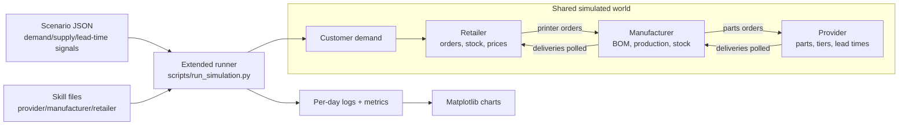
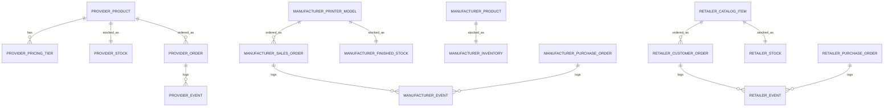

# Lab 8 Report - Autonomous Supply Chain and Analysis

## A. System Architecture

Lab 8 completed the three-week arc: all three roles have skill files, the scenarios include real market pressure, and the simulation produces logs and charts that can be analyzed after the run. The final system keeps execution deterministic where correctness matters and uses role skills where business decisions are needed.

The final runner is `scripts/run_simulation.py`. It reads a scenario, applies the day signal, injects customer orders, runs the three role turns, advances all apps, and writes metrics. The scenario merge rule for overlapping events is multiplicative. For example, during the overlap of chip shortage and Christmas rush, demand and lead-time modifiers compound instead of replacing one another. This makes days 18-20 of `holiday-rush` the strongest stress period.

The service boundaries stayed the same as Lab 7:

- Provider owns part stock, tier prices, lead times, and provider orders.
- Manufacturer owns raw inventory, printer models, BOMs, production, finished stock, and retailer sales orders.
- Retailer owns customer demand, retail stock, backorders, purchases from manufacturer, and retail prices.

The final PRD in `docs/PRD.md` now reflects this system rather than the original Week 5 single-factory app.

### Data Model

The apps do not share one universal schema because they represent different organizations. This was a good trade-off: it avoids coupling, but it means the turn engine and reports must normalize metrics across different local models.

## B. Agent Design

The final skill set contains:

- `skills/provider-manager.md`
- `skills/manufacturer-manager.md`
- `skills/retail-manager.md`

The provider skill manages restocking and supplier price changes. It watches stock against starting thresholds and reacts to shortage signals with controlled price increases. The manufacturer skill manages order release, part purchasing, and wholesale price increases when backlog or utilization is high. The retail skill processes customer orders, backorders unmet demand, creates printer purchases, and adjusts retail prices while respecting the wholesale markup floor.

The first versions of the skills were too exploratory. They asked the agent to inspect state, reason, choose commands, and act. That worked for one-day demos but became slow and brittle in long simulations. The final skills use a fast path: the runner provides current state plus an `ACTION HINT`, and the role executes recommended commands or reports no action. This preserved the educational idea of role skills while keeping long runs auditable and short enough.

One important rewrite was the provider behavior. The Lab 8 statement explicitly warns that provider stockouts can cascade. The skill therefore gained rules about restocking products below threshold and limiting daily price changes. Another rewrite was the retailer behavior. The retailer has to process every pending order, otherwise the backlog state becomes misleading. The final retail skill starts with `process-orders` and then places purchases sized against backlog and buffer.

What the agents are good at:

- Following explicit command hints.
- Writing readable summaries of why they acted.
- Applying simple threshold rules.
- Keeping local decisions separated by role.

What they are bad at:

- Discovering the right command in a large CLI surface without help.
- Planning several lead times ahead unless the prompt makes that look-ahead explicit.
- Balancing price, service level, and stock without turning the rule into a concrete action.

## C. Simulation Results

Two scenarios were used for analysis:

- `calm-market`: stable control run, 15 logged days.
- `holiday-rush`: volatile run, 25 logged days with normal demand, Black Friday, chip shortage, and Christmas rush.

The generated evidence is stored as metrics logs in `logs/` and charts in `reports/`.

### Inventory Over Time

In the calm run, customer demand is stable but still enough to drain retail stock early. Retailer total stock starts at 10 units on day 1 and ends at 2 units on day 15, with a minimum of 0. Manufacturer raw stock falls from 190 to 90 units, showing that even the control scenario consumes buffers faster than the upstream system replaces them.

In the holiday run, the retailer is under pressure almost immediately. Retail stock starts at 8 units and repeatedly hits zero. Manufacturer raw stock falls to a minimum of 57 units during the stressed middle of the run, then recovers to 295 by day 25 as provider deliveries and restocks catch up. This recovery is important: the later run does not show permanent supplier collapse, but it does show delayed upstream response.

### Prices Over Time

The calm run shows retail price increases while wholesale and provider prices remain flat. Retail prices move from `479.99/279.99/729.99` to `820.94/527.96/845.05` for Classic, Mini, and Pro. This means the retailer is using price as a local pressure valve even when the manufacturer and provider do not adjust.

The holiday run has much stronger price movement. By day 25, wholesale prices reach `546.67`, `367.73`, and `957.79`, while retail prices reach `1100.14`, `780.04`, and `1936.86`. Provider tier prices also move for selected constrained parts: `kit_piezas` tier 10 rises from `135.0` to `171.52`, and `transformador_24v` tier 50 rises from `18.0` to `23.96`. Prices do not oscillate wildly; they rise as a response to persistent backlog, low stock, and supply stress.

### Order Fulfillment

The calm run receives 80 customer orders over 15 days. It fulfills 59 and ends with 21 backordered orders. The biggest daily demand is 10 orders on day 4. This tells us the baseline is not "healthy"; it is stable but under-provisioned. The agents can serve many customers, but lead times and stock buffers are too small to avoid chronic backlog.

The holiday run receives 212 customer orders over 25 days. It fulfills 164 and ends with 48 backordered orders. The largest demand day is day 20, with 18 placed orders, 38 fulfilled orders, and 18 new backorders. The high fulfilled count on day 20 is a catch-up burst: stock that arrived from earlier manufacturer activity was immediately consumed by accumulated demand.

### Event Overlay and Causal Chain

The event phases explain the shape of the volatile run:

- Days 1-7: normal demand still drains retailer stock because starting inventory is small.
- Days 8-12: Black Friday increases demand before enough finished printers can arrive.
- Days 13-20: chip shortage reduces supplier effectiveness and extends lead times.
- Days 18-20: chip shortage and Christmas overlap, multiplying the stress.
- Days 21-25: Christmas demand remains high, but prices and recovered upstream stock dampen the later collapse.

The most visible emergent behavior is a bullwhip pattern. Customer demand spikes at the retailer, retailer purchases amplify it into printer orders, manufacturer BOM expansion amplifies it again into part orders, and provider stock/price changes arrive with delay. The manufacturer raw-stock recovery by day 25 is not simply "good news"; it is also evidence that upstream orders placed during panic conditions can keep arriving after downstream demand has already changed.

### Required Questions

**Did the manufacturer build stock ahead of Black Friday?**  
Only partially. It reacted to retailer demand and released orders, but the system did not intentionally prebuild enough finished-printer stock before day 8. Retail stock reached zero during the early stress period, so preparation was reactive rather than anticipatory.

**When stockouts happened, whose decision was proximate and whose was root cause?**  
The proximate cause was retailer exposure: starting stock was too low for the incoming demand and reorder lead times. The root cause was system-wide planning latency: the manufacturer and provider reacted after demand became visible, and the compounded lead times meant upstream correction arrived late.

**Did prices stabilize or oscillate?**  
Prices mostly trended upward. Retail and wholesale prices rose as backlog persisted; provider prices increased on constrained tiers. The run shows damped escalation rather than a price war or collapse.

**Can we identify a bullwhip moment?**  
Yes. The day 8-20 demand shock becomes larger upstream as retailer backorders create printer orders and printer orders expand into BOM part purchases. The later recovery of manufacturer raw stock while backorders still exist is the signature: upstream inventory movement is amplified and delayed relative to the original customer demand.

## D. Vibe-Coding Reflection

Across Labs 6-8, Claude Code was most valuable when the architecture was already explicit. It generated repeated service patterns quickly, helped wire APIs and CLIs, and made it easier to evolve the same idea across provider, manufacturer, and retailer.

It struggled when asked to solve too broad a problem at once. "Build the autonomous simulation" was too large. The successful prompts were narrower: add a provider endpoint, add retailer purchase polling, write a skill that forbids day advance, or summarize a metrics log. The PRD-first workflow helped because each lab had a stable vocabulary and a target architecture before the code changed.

The one thing we would redesign is observability. We added useful metrics and charts, but they should have been first-class from Lab 6. Every day advance should snapshot key metrics into each database or a shared metrics file from the beginning. That would make every run reproducible and reduce the need to reconstruct facts from events after the fact.

The main lesson is that multi-agent software is less about "smarter prompts" and more about boundaries. The deterministic services execute state changes; the REST contracts keep responsibilities clear; the engine owns time; the skills provide local decision rules; and the logs make the result explainable. When those boundaries hold, the agents can make imperfect decisions without making the system impossible to understand.

