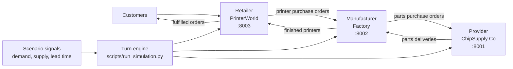

# Week 8 Presentation - Autonomous Supply Chain

## Slide 1 - Title

**Autonomous 3D Printer Supply Chain**

Three independent agents managing a volatile market:

- Provider: supplies raw parts
- Manufacturer: builds 3D printers
- Retailer: sells printers to customers

Demo scenario: `holiday-rush`

Speaker note:
This project simulates a small supply chain where each company has its own database, API, CLI, and decision-making agent. The interesting part is that coordination emerges through shared world state, not direct communication.

---

## Slide 2 - System Overview

Key idea:
Each app owns its own SQLite database and exposes REST endpoints. The engine advances time, injects demand, gives each agent the current state, then advances all services in lock-step.

---

## Slide 3 - Turn Design

One simulated day:

1. Read scenario signal for the day
2. Inject customer demand into the retailer
3. Provider reacts to stock pressure and supply conditions
4. Manufacturer releases orders, buys parts, adjusts wholesale prices
5. Retailer processes customers and buys printers
6. All three apps advance one day
7. Narrative log and metrics are saved

Why this order:
The upstream provider acts before the manufacturer places new pressure, then the manufacturer reacts to retail demand, and the retailer closes the loop with customers.

---

## Slide 4 - Agent Design: Provider

Role:
Keep parts available while adjusting prices under supply pressure.

Inputs:

- Current stock vs starting stock
- Open manufacturer orders
- Product price tiers
- Market signal: `supply_modifier`, `lead_time_modifier`, `demand_modifier`

Actions:

- Restock products below threshold
- Raise prices during supply shortage
- Avoid stockouts on critical parts when possible

Design choice:
The prompt now gives RESTOCK flags and a ready-to-run action hint, so the agent does not waste turns doing catalog and stock analysis.

---

## Slide 5 - Agent Design: Manufacturer

Role:
Convert retail purchase orders into finished printers.

Inputs:

- Retail sales orders
- Raw-parts stock
- Finished-printer stock
- Supplier catalog
- Open part purchase orders
- BOM per printer model

Actions:

- Release pending sales orders to production
- Order missing parts from provider
- Raise wholesale prices when utilisation/backlog is high

Important fix:
The manufacturer now buys against backlog plus buffer, not only tiny immediate shortages. It also avoids counting `in_progress` orders as new part demand because their BOM has already been consumed.

---

## Slide 6 - Agent Design: Retailer

Role:
Serve customer demand and decide how many printers to buy.

Inputs:

- Customer orders
- Retail stock
- Open purchases from manufacturer
- Wholesale prices
- Demand and price-sensitivity signals

Actions:

- Process every pending customer order
- Backorder when stock is unavailable
- Purchase enough printers to cover backlog plus a demand buffer
- Raise retail prices when stock pressure is high

Implementation note:
The retailer was made deterministic/direct for the long run because the LLM version hit max turns too often. This kept the simulation stable and auditable.

---

## Slide 7 - Scenario: Holiday Rush

`holiday-rush` phases:

- Days 1-7: normal pre-holiday demand
- Days 8-12: Black Friday, demand x3, high price sensitivity
- Days 13-20: chip shortage, supply x0.4, lead times x2
- Days 18-25: Christmas rush, demand x2.5, supply x0.6, lead times x1.5

Overlapping events compound:
Days 18-20 combine chip shortage and Christmas rush, producing the strongest stress test.

What we expect:
Retail stockouts, manufacturer backlog, provider pressure, price increases, and possible bullwhip behaviour.

---

## Slide 8 - Most Interesting Run Observations

Current `holiday-rush` narrative shows:

- Retailer stock reaches zero early and stays under pressure
- Backorders grow rapidly during Black Friday
- Manufacturer backlog is high but causally reasonable
- Manufacturer starts placing much larger part orders once demand spikes
- Provider repeatedly restocks `kit_piezas` back to its initial level
- Prices do increase:
  - Provider raises `kit_piezas`
  - Provider uses `price raise-all` during chip shortage
  - Manufacturer raises wholesale prices under high utilisation

Slide image to add:
Use the final "order fulfillment" or "inventory over time" chart once the 25-day run finishes.

---

## Slide 9 - Emergent Behaviour

Bullwhip pattern:

Small downstream demand changes become larger upstream reactions:

- Customer spike creates retailer backorders
- Retailer places larger printer orders
- Manufacturer creates even larger part orders because each printer expands into a BOM
- Provider stock is depleted and restocked repeatedly

Unexpected behaviours worth explaining:

- `kit_piezas` keeps returning to 120 because that is the provider's initial-stock restock target
- Some part orders are rejected when provider available stock is lower than requested
- Chained bash commands can stop after one rejected order, leaving later planned purchases unexecuted

These are useful demo moments because they show the system is not just scripted; local rules interact.

---

## Slide 10 - Live Demo + Reflection

Live demo plan:

1. Reset the system
2. Run 3 days of `presentation-demo`
3. Show the narrative log updating
4. Point out one decision per agent
5. Show one chart from the completed 25-day run

Backup plan:
If agents stall, use the saved `logs/narrative_holiday-rush.md` and final charts.

Reflection:

- Clear local prompts matter more than long prompts
- Pre-fetching state reduced wasted reasoning turns
- LLM agents are useful for strategy, but deterministic execution is better for repetitive low-level loops
- The hardest part was observability: without logs and metrics, emergent behaviour is impossible to explain
