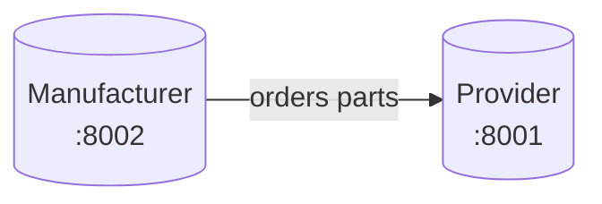
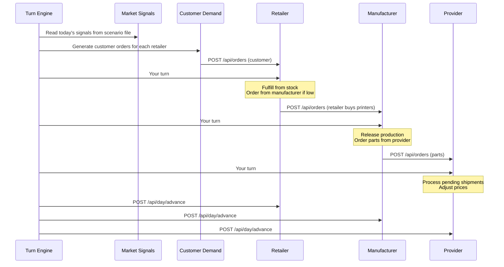

# Week 7 — The Supply Chain (Part 2): The Retailer and the Turn Engine

## Where you are

Last week you built the provider and wired your Week 5 manufacturer to call it over REST. Two apps, two databases, one coherent simulated world — advanced manually by a human typing CLI commands.



This week you complete the chain and start automating it.

## What you build this week

Three things, in this order:

1. **The retailer app** — the third process in the supply chain. Sells printers to end customers.
2. **The turn engine** — a script that advances all three apps in lock-step, generates customer demand, and (later) invokes agents.
3. **Your first skill file** — a markdown document that teaches Claude Code how to play one role in the system. Run it end-to-end on one role as a proof of concept.

By the end of today:

1. All three apps run, on their own ports, and talk to each other over REST
2. A turn engine script runs one full simulated day without any human input
3. One skill file exists and Claude Code has executed it once, making real decisions for one role
4. The event logs across all three apps tell a coherent story of the day

This is not a full autonomous simulation. That is Week 8. This week we get the plumbing and the first agent working.

---

# Part 1: Core concepts

## Orchestration: why a turn engine

Last week a human advanced each app one at a time. That works for 5 days. It does not work for 25 days, and it certainly does not work when agents are making decisions mid-turn.

The turn engine is a single script that:

1. Decides what happens each day (from a scenario file)
2. Injects customer demand
3. Runs each role’s decisions (first deterministically, later via LLM agents)
4. Advances all apps to the next day
5. Logs what happened

The engine is your conductor. Everything keeps its own state, but the engine decides when things happen and in what order.

## Order of operations per turn



The order of the “your turn” steps matters: downstream actors decide first, upstream actors react. You can defend a different order in your PRD, but you must be deliberate about it.

## Subprocess automation with `claude --print`

Claude Code is normally interactive. You type, it responds, you read. For an autonomous turn engine you need it to run without a human in the loop.

The `--print` flag does exactly this:

```bash
claude --print --prompt "Read skills/manufacturer-manager.md and make today's decisions. Tod…"
```

*(The example line is truncated in the source PDF.)*

Claude Code runs, executes commands, and prints its final response to stdout. The process exits when done.

From the engine:

```python
import subprocess

result = subprocess.run(
    ["claude", "--print", "--prompt", prompt],
    capture_output=True,
    text=True,
    cwd=app_working_dir,
    timeout=180,
)
print(result.stdout)
```

This is exactly how you will invoke agents each turn.

## What is a Claude Code skill?

A skill is a markdown file that teaches Claude Code how to perform a specific role. It contains:

- **Role:** who the agent is and what it is responsible for
- **Commands:** the CLI commands it has access to
- **Decision framework:** the logic for making choices
- **Constraints:** what it must not do
- **Context handling:** how to interpret market signals or other inputs

The skill file is the contract between you (the designer) and the agent. If the agent misbehaves, you fix the skill. If the skill is clear and the agent still misbehaves, the skill is not clear enough.

You will write one skill this week. Next week you will write the rest.

## Customer demand: deterministic first

End customers place orders with retailers. Later, we may model customers as LLM agents. This week you generate demand deterministically from the scenario file:

```python
import random

def generate_customer_demand(day, signal, retailer_prices, base_price):
    base = signal.get("base_demand", {"mean": 5, "variance": 2})
    modifier = signal.get("demand_modifier", 1.0)
    orders = []
    for model, price in retailer_prices.items():
        mean_orders = base["mean"] * modifier
        price_factor = max(0.2, 1.0 - (price - base_price) / base_price)
        adjusted_mean = mean_orders * price_factor
        n = max(0, int(random.gauss(adjusted_mean, base["variance"])))
        orders.extend([(model, 1)] * n)
    return orders
```

Higher prices → less demand. Demand modifier from the scenario shifts the whole curve. This is enough for realistic dynamics.

---

# Part 2: The retailer app (full spec)

A retailer buys finished printers from the manufacturer and sells them to end customers.

## Data model

- **Catalog:** which printer models this retailer sells, at what retail price
- **Customer orders:** orders received from end customers
- **Purchase orders:** orders placed with the manufacturer
- **Stock:** current inventory of finished printers
- **Sales history**
- **Events**

## CLI commands

```text
retailer-cli catalog                                  # models and retail prices
retailer-cli stock                                    # current inventory
retailer-cli customers orders                         # list customer orders (optional --status)
retailer-cli customers order <order_id>               # details of a customer order
retailer-cli fulfill <order_id>                       # ship to customer from stock
retailer-cli backorder <order_id>                     # mark as backordered
retailer-cli purchase list                            # orders placed with manufacturer
retailer-cli purchase create <model> <qty>            # order printers from manufacturer
retailer-cli price set <model> <price>                # set retail price
retailer-cli day advance                              # advance one day
retailer-cli day current                              # current simulation day
retailer-cli export                                   # dump state to JSON
retailer-cli import <file>                            # load state from JSON
retailer-cli serve --port 8003                        # start the REST API
```

## REST endpoints

```text
GET  /api/catalog              # models with retail prices
GET  /api/stock                # current inventory
POST /api/orders               # end customer places an order
GET  /api/orders               # list customer orders (optional ?status=)
GET  /api/orders/{id}           # order details
POST /api/purchases            # order from manufacturer
GET  /api/purchases            # list purchase orders
POST /api/day/advance          # advance one day
GET  /api/day/current          # current day
```

## Key behaviour

- Customer orders are fulfilled from stock if available, otherwise backordered (queued until stock arrives)
- The retailer can place purchase orders with the manufacturer; arrivals are polled the same way the manufacturer polls the provider
- Prices are set by the retailer; they must stay above manufacturer wholesale price + margin (your choice, minimum 15%)
- On day advance, backordered customer orders whose stock has now arrived should be auto-fulfilled (or at least flagged)

## Configuration

```json
{
    "retailer": {
      "name": "PrinterWorld",
      "port": 8003,
      "manufacturer": {"name": "Factory", "url": "http://localhost:8002"},
      "markup_pct": 30
    }
}
```

## Designed for multiple instances

The retailer app must be runnable as multiple instances on different ports with different config files. Do not hard-code paths or ports. You may not need multiple instances today, but you will want them next week for market experiments.

```bash
retailer-cli serve --config retailer-1.json --port 8003
retailer-cli serve --config retailer-2.json --port 8005
```

---

# Part 3: Adapting the manufacturer app (again)

The manufacturer now has to accept inbound orders from retailers, not just place outbound orders with providers. Add:

- `POST /api/orders` — accept an order from a retailer (payload: retailer name, model, qty)
- A new table (or reuse your orders table with a direction column) to track sales orders — orders received from retailers
- CLI commands:
  - `manufacturer-cli sales orders` — orders received from retailers
  - `manufacturer-cli sales order <id>` — order details
  - `manufacturer-cli production release <order_id>` — release an order to production
  - `manufacturer-cli production status` — what is currently being made
  - `manufacturer-cli capacity` — daily capacity + utilisation
  - `manufacturer-cli price list` — wholesale prices
  - `manufacturer-cli price set <model> <price>` — set wholesale price
- Manufacturing logic during day advance:
  1. Orders released yesterday and whose BOM parts are in stock → move to in_progress, consume parts
  2. Orders in progress for their production duration → completed, add to finished-printer stock
  3. Sales orders with finished-printer stock → shipped → delivered, decrement finished stock
  4. Manufacturer’s own purchase orders from providers → poll and receive as before
  5. Every transition goes into the event log

Keep your Week 5 UI working alongside this. The CLI/API is what agents use; the UI is for humans to watch.

---

# Part 4: The turn engine

## Scope this week

- **Deterministic version first:** no agents. The engine simply calls a stub “make decisions” function for each role, then advances all apps.
- Once the deterministic flow is clean, upgrade one role (recommended: manufacturer-manager) to call Claude Code via `--print`.

## Skeleton

```python
#!/usr/bin/env python3
"""Turn engine: orchestrates one simulated day across all apps."""

import subprocess
import json
import httpx
from pathlib import Path

def load_config(path):
    return json.loads(Path(path).read_text())

def load_scenario(path):
    return json.loads(Path(path).read_text())

def todays_signal(day, scenario):
    signal = {"day": day, "events": []}
    for event in scenario.get("events", []):
        if event["start_day"] <= day <= event["end_day"]:
            signal["events"].append(event)
            signal["demand_modifier"] = event.get("demand_modifier", 1.0)
    signal.setdefault("demand_modifier", 1.0)
    signal["base_demand"] = scenario.get("base_demand", {"mean": 5, "variance": 2})
    return signal

def generate_customer_orders(retailer_url, signal):
    # fetch retailer catalog, generate N orders, POST each
    catalog = httpx.get(f"{retailer_url}/api/catalog").json()
    # ... deterministic generator from Part 1 ...
    for model, qty in orders:
        httpx.post(f"{retailer_url}/api/orders",
                   json={"customer": "auto", "model": model, "quantity": qty})

def run_agent_or_stub(role, skill_path, context, cwd):
    """Phase 1: stub. Phase 2: call claude --print."""
    if skill_path is None:
        print(f"[stub] {role} would make decisions here")
        return
    prompt = f"""
Read the skill file at {skill_path}.
Today's context: {context}
Execute your daily decisions following the skill's decision framework.
Do NOT advance the day — the turn engine does that.
"""
    result = subprocess.run(
        ["claude", "--print", "--prompt", prompt],
        capture_output=True, text=True, cwd=cwd, timeout=180,
    )
    print(f"[{role}]\n{result.stdout}")

def advance_all(urls):
    for url in urls:
        httpx.post(f"{url}/api/day/advance")

def run_day(day, config, scenario):
    signal = todays_signal(day, scenario)
    print(f"\n{'='*60}\n DAY {day}    signal={signal}\n{'='*60}")

    for retailer in config["retailers"]:
        generate_customer_orders(retailer["url"], signal)

    for retailer in config["retailers"]:
        run_agent_or_stub("retailer", retailer.get("skill"),
                          json.dumps(signal), retailer["path"])

    run_agent_or_stub("manufacturer",
                      config["manufacturer"].get("skill"),
                      json.dumps(signal),
                      config["manufacturer"]["path"])

    for provider in config["providers"]:
        run_agent_or_stub("provider", provider.get("skill"),
                          json.dumps(signal), provider["path"])

    advance_all(
        [r["url"] for r in config["retailers"]]
        + [config["manufacturer"]["url"]]
        + [p["url"] for p in config["providers"]]
    )

if __name__ == "__main__":
    import sys
    config = load_config(sys.argv[1])
    scenario = load_scenario(sys.argv[2])
    days = int(sys.argv[3])
    for day in range(1, days + 1):
        run_day(day, config, scenario)
```

## Minimal scenario file

A trivial scenario is fine for today:

```json
{
    "scenario_name": "smoke-test",
    "base_demand": {"mean": 4, "variance": 1},
    "events": [
      {"name": "normal", "start_day": 1, "end_day": 10,
       "demand_modifier": 1.0, "description": "Steady state"}
    ]
}
```

Richer scenario design is next week.

## Running it

```bash
python turn_engine.py config/sim.json scenarios/smoke-test.json 3
```

Three simulated days, all apps advanced, customer demand injected, one agent making real decisions. If this runs clean, you have the skeleton of Week 8.

---

# Part 5: Your first skill file

Write one skill file this week. We strongly recommend `manufacturer-manager.md` because it is the most interesting role and the one that will exercise both upstream (providers) and downstream (retailers) connections.

Create `skills/manufacturer-manager.md`:

````markdown
# Skill: Manufacturer Manager

## Your Role

You manage the production of a 3D printer factory. Each simulated day you:
1. Review incoming orders from retailers
2. Check inventory of parts and finished printers
3. Release sales orders to production when materials allow
4. Order parts from suppliers when stock runs low
5. Adjust wholesale prices based on demand vs capacity

## Available Commands

### Check current state
- `./manufacturer-cli day current`
- `./manufacturer-cli stock`
- `./manufacturer-cli sales orders`
- `./manufacturer-cli sales order <id>`
- `./manufacturer-cli production status`
- `./manufacturer-cli capacity`

### Purchasing
- `./manufacturer-cli suppliers list`
- `./manufacturer-cli suppliers catalog <supplier_name>`
- `./manufacturer-cli purchase list`
- `./manufacturer-cli purchase create --supplier <name> --product <id> --qty <n>`

### Production
- `./manufacturer-cli production release <order_id>`

### Pricing
- `./manufacturer-cli price list`
- `./manufacturer-cli price set <model> <price>`

## DO NOT
- Do NOT call `day advance`. The turn engine does that.
- Do NOT release more orders than daily capacity allows.
- Do NOT order parts that will arrive after the orders needing them are overdue if a faster…

## Decision Framework

Each day, in order:

1. **Assess.** Run `stock`, `sales orders`, `capacity`, `production status`. Summarise in 2–…
2. **Fulfill what you can.** For each pending sales order, if parts are in stock and product…
3. **Order what you need.** For each part where stock is below two days of expected consumpt…
4. **Adjust prices.** If orders exceed capacity by more than 50% for 2+ days, raise wholesal…
5. **Log your reasoning.** Before each mutation, print a one-line explanation: "releasing or…

## Market Signals

You may receive market signal information in your prompt. Interpret it:
- `demand_modifier > 1.5`: high-demand period. Build inventory ahead, consider raising price…
- `supply_modifier < 0.7`: constrained supply. Place purchase orders earlier and larger.
- No signal / modifier ≈ 1.0: business as usual.

## When Done

Print a summary of what you did today and why, in 3–5 bullet points. Then exit. Do not advan…
````

*(Several bullets in the PDF end mid-sentence; `…` marks truncation in the source.)*

**Notes on writing a good skill file:**

- Explicit “DO NOT” section matters. LLMs are eager to help. The turn engine advancing the day is the canonical foot-gun — every skill must forbid it.
- Ask for reasoning before mutations. This is your audit trail.
- Force a final summary. It makes the logs readable and catches cases where the agent did nothing.
- Name specific commands. If the agent can invent a command, it will — and get it wrong.

---

# Part 6: The proof-of-concept run

Once the skill exists and the deterministic engine works:

1. Point the engine’s config at `skills/manufacturer-manager.md` for the manufacturer role
2. Leave the retailer and provider as stubs
3. Run `python turn_engine.py config/sim.json scenarios/smoke-test.json 1`
4. Read the full output. You should see:
   - Customer demand injected into the retailer
   - Stubs for retailer and provider (nothing happens there yet)
   - Claude Code invoked for the manufacturer, with a full log of what it inspected and what it decided
   - All three apps advanced to day 2
5. Inspect the manufacturer’s event log — real decisions by the agent should appear as `order_placed` and `production_released` events

If the agent does something dumb, do not rewrite the agent. Rewrite the skill. This is the core discipline of the week.

Repeat for a second day. If day 2 still makes sense, you are in good shape for Week 8.

---

# Part 7: Verification checklist

- [ ] All three apps start on their own ports and serve their APIs
- [ ] Retailer CLI works for all core commands
- [ ] Manufacturer accepts inbound retailer orders and processes them
- [ ] Customer demand generator injects orders at retailers
- [ ] Turn engine runs deterministic (stub) mode for 3 days without errors
- [ ] One skill file exists (`skills/manufacturer-manager.md`)
- [ ] Turn engine runs with manufacturer-as-agent for at least 1 day
- [ ] Manufacturer event log shows agent decisions
- [ ] Agent output (`claude --print`) is captured and stored somewhere, not just printed to stdout
- [ ] JSON export/import works for all three apps

---

# Part 8: Deliverables

## 1. GitHub repository

- Three apps (`provider/`, `manufacturer/`, `retailer/`)
- `turn_engine.py` (or directory)
- `skills/manufacturer-manager.md` (the first skill)
- `config/sim.json` (where the engine is pointed)
- `scenarios/smoke-test.json` (the minimal scenario)
- Updated `CLAUDE.md`
- Updated `docs/PRD.md` with the orchestration design
- Updated `README.md` with run instructions including the turn engine
- Commit history with issue references

## 2. Short report (3–4 pages, PDF)

Generated with pandoc + mermaid-filter.

Must cover:

- Architecture diagram of the full three-app system + engine
- Turn engine design: what order you chose for roles and why
- The skill file — paste it, then explain two decisions you made when writing it
- The proof-of-concept run: excerpts of the agent’s output, plus your commentary on what it did well and where it was shaky
- Vibe-coding notes: what Claude Code (building the software) and the agent (executing the role) each did well or poorly

## 3. Live demo

The noop will ask a team to run one turn with the first skill active. Be ready with a clean scenario file and tidy output.

---

# Part 9: Technical hints

## Logging agent output

Capture everything. Save it to a file named for the day:

```python
Path(f"logs/day-{day:03d}-{role}.log").write_text(result.stdout)
```

Next week’s analysis will depend on this. Do not throw it away.

## Timeouts

Claude Code sessions can stall or run long. Set a timeout (180s is reasonable for a single role’s turn) and handle the timeout case in the engine — log it, move on to the next role. Do not let one stuck agent freeze the whole simulation.

## Start the engine with one app first

Get the engine talking to just the manufacturer, with no retailer or provider involvement. Once that works, add the retailer. Then add the provider. This gives you three debuggable steps instead of one unknown.

## Prompt caching

`claude --print` sessions are short-lived. Every turn is a fresh context. Keep the skill files concise and the per-turn context (market signal, current day) small. Do not paste the whole database into the prompt.

## Skill file iteration

Expect to rewrite the skill file 3–5 times before it behaves well. That is normal. Each rewrite is you learning what the LLM actually does when given your instructions.

## API key safety

Same rules. Every week.

```gitignore
.env
__pycache__/
.venv/
*.db
logs/
```

Add `logs/` this week — the agent output can be large and is per-run, not worth committing.

---

# Summary

| What | How |
|------|-----|
| New app this week | Retailer |
| New orchestration | Turn engine (deterministic first, then one agent) |
| New artefact | First Claude Code skill file |
| LLM agent scope | One role (recommended: manufacturer) |
| Deliverable | 1-day autonomous turn with real agent output |
| Next week | Full autonomy, market signals, 15+ day simulation, analysis |

The hard part of this week is not the code. It is writing a skill file that actually works. The agent will do exactly what you tell it — no more, no less. If that makes you nervous, it should. Next week you will have three of them running at once.

---

*Converted from `week7.pdf` (LaTeX via pandoc, 14 pages). Mermaid diagrams and code blocks were reconstructed for readability; a few PDF lines were truncated at the margin in the original — see notes above.*
